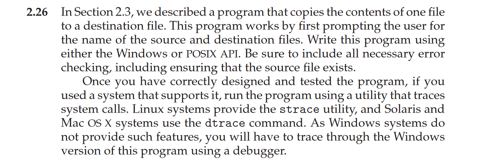

# Chapter 2 exercises

The answers to the exercises in this chapter are mostly referent from http://personal.kent.edu/~rmuhamma/OpSystems/os.html

#### 2.1 What is the purpose of system calls?

System calls provide an interface between the process an the operating system. System calls allow user-level processes to request some services from the operating system which process itself is not allowed to do. In handling the trap, the operating system will enter in the kernel mode, where it has access to privileged instructions, and can perform the desired service on the behalf of user-level process. It is because of the critical nature of operations that the operating system itself does them every time they are needed. For example, for I/O a process involves a system call telling the operating system to read or write particular area and this request is satisfied by the operating system.

---

#### 2.2 What are the five major activities of an operating system with regard to process management?

A process (or job) is the fundamental unit of work in an operating system:

- Creation and deletion of user and system processes.
- Suspension and resumption of processes.
- A mechanism for process synchronization.
- A mechanism for process communication.
- A mechanism for deadlock handling.

---

#### 2.3 What are the three major activities of an operating system with regard to memory management?

- Keep track of which part of memory are currently being used and by whom.
- Decide which process are loaded into memory when memory space becomes available.
- Allocate and deallocate memory space as needed.

---

#### 2.4 What are the three major activities of an operating system with regard to secondary-storage management?

- Managing the free space available on the secondary-storage device.
- Allocation of storage space when new files have to be written.
- Scheduling the requests for memory access.

---

#### 2.5 What is the purpose of the command interpreter? Why is it usually separate from the kernel?

A command interpreter is an interface of the operating system with the user. The user gives commands with are executed by operating system (usually by turning them into system calls). The main function of a command interpreter is to get and execute the next user specified command. Command-Interpreter is usually not part of the kernel, since multiple command interpreters (shell, in UNIX terminology) may be support by an operating system, and they do not really need to run in kernel mode. There are two main advantages to separating the command interpreter from the kernel.

- If we want to change the way the command interpreter looks, i.e., I want to change the interface of command interpreter, I am able to do that if the command interpreter is separate from the kernel. I cannot change the code of the kernel so I cannot modify the interface.
- If the command interpreter is a part of the kernel it is possible for a malicious process to gain access to certain part of the kernel that it showed not have to avoid this ugly scenario it is advantageous to have the command interpreter separate from kernel.

---

#### 2.6 What system calls have to be executed by a command interpreter or shell in order to start a new process?

Windows:
- CreateProcess()

Linux:
- fork()

---

#### 2.7 What is the purpose of system programs?

System programs provide basic functioning to users so that they do not need to write their own environment for program development (editors, compilers) and program execution (shells). In some sense, they are bundles of useful system calls.

---

#### 2.8 What is the main advantage of the layered approach to system design? What are the disadvantages of the layered approach?

In this case the system is easier to debug and modify, because changes affect only limited portions of the code, and programmer does not have to know the details of the other layers. Information is also kept only where it is needed and is accessible only in certain ways, so bugs affecting that data are limited to a specific module or layer. 
The disadvantage of the layered approach is that it can be complex to implement and maintain, and it can be difficult to change the design if the requirements change.

---

#### 2.9 List five services provided by an operating system, and explain how each creates convenience for users. In which cases would it be impossible for user-level programs to provide these services? Explain your answer.

- Program execution: 
- file systems: 
- I/O operations:
- Resource allocation: 
- Communication: 

---

#### 2.10 Why do some systems store the operating system in firmware, while others store it on disk?

Storing the operating system in ROM is suitable for small operating systems, simple supporting hardware, and rugged operation.
- The hardware is not likely to change, and the operating system is also not likely to change.

For large operating systems (including most general-purpose operating systems like Windows, Mac OS X , and UNIX ) or for systems that change frequently, the bootstrap loader is stored in firmware, and the operating system is on disk.

---

#### 2.11 How could a system be designed to allow a choice of operating systems from which to boot? What would the bootstrap program need to do?

---

#### 2.12 The services and functions provided by an operating system can be divided into two main categories. Briefly describe the two categories, and discuss how they differ.

- policy - what will be done
- mechanism - how to do something

---

#### 2.13 Describe three general methods for passing parameters to the operating system.

**Passing Parameters in Registers:**

- The simplest and fastest method involves placing the parameters directly into the CPU registers. Since registers are directly accessible by the operating system, this method minimizes overhead. However, the number of registers is limited, making it impractical for passing many parameters.

**Passing Parameters via a Memory Block (or Table):**

- When a large number of parameters need to be passed, they are often stored in a block or table in memory. The address of this block is then passed to the operating system using a register. This method is efficient for handling multiple or large-sized parameters and avoids register limitations.

**Passing Parameters via the Stack:**

- Parameters can also be pushed onto the program’s stack in memory. The operating system then pops these parameters off the stack as needed. This method is commonly used in procedure calls because it provides a flexible and organized way to pass parameters without requiring additional data structures.

---

#### 2.14 Describe how you could obtain a statistical profile of the amount of time spent by a program executing different sections of its code. Discuss the importance of obtaining such a statistical profile.

---

#### 2.15 What are the five major activities of an operating system with regard to file management?

- The creation and deletion of files.
- The creation and deletion of directions.
- The support of primitives for manipulating files and directions.
- The mapping of files onto secondary storage.
- The back up of files on stable storage media.

---

#### 2.16 What are the advantages and disadvantages of using the same system-call interface for manipulating both files and devices?

Ref: https://learnloner.com/advantages-and-disadvantages-of-same-system-call-interface/

Advantages of Using Same System Call Interface:
- Simplified Programming
- Reduced Overhead
- Increased Flexibility
- Improved Compatibility

Disadvantages of Using Same System Call Interface
- Reduced Security
- Increased Complexity
- Reduced Performance
- Limited Functionality

---

#### 2.17 Would it be possible for the user to develop a new command interpreter using the system-call interface provided by the operating system?

Yes

---

#### 2.18 What are the two models of inter-process communication? What are the strengths and weaknesses of the two approaches?

---

#### 2.19 Why is the separation of mechanism and policy desirable?
The separation of policy and mechanism is important for flexibility.

- Policies are likely to change across places or over time.
- On other hand, mechanisms should be stable and well-defined. Changing mechanisms is require re-designing, re-structuring, and re-coding of related parts of the system.

---

#### 2.20 It is sometimes difficult to achieve a layered approach if two components of the operating system are dependent on each other. Identify a scenario in which it is unclear how to layer two system components that require tight coupling of their functionalities.

---

#### 2.21 What is the main advantage of the micro-kernel approach to system design? How do user programs and system services interact in a micro-kernel architecture? What are the disadvantages of using the micro-kernel approach?

---

#### 2.22 What are the advantages of using loadable kernel modules?

Programming Problems:

Part II Assignment
In the module entry point, create a linked list containing five struct birthday elements. Traverse the linked list and output its contents to the kernel log buffer.
Invoke the dmesg command to ensure the list is properly constructed once the kernel module has been loaded.
In the module exit point, delete the elements from the linked list and return the free memory back to the kernel. Again, invoke the dmesg command to check that the list has been removed once the kernel module has been unloaded