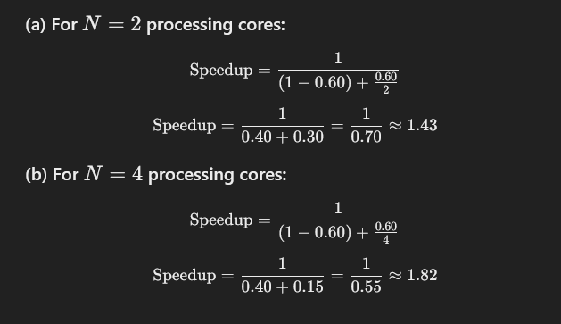

# Chapter 4 exercises


### 4.1 Provide two programming examples in which multithreading provides better performance than a single-threaded solution.
- Web browser handle multiple tab in the same time
- Web server handle multiple request.

---

### 4.2 What are two differences between user-level threads and kernel-level threads? Under what circumstances is one type better than the other?
- User threads: Supported above the kernel and are managed without kernel support
- Kernel threads: Supported and managed directly by the operating system.

Ref: https://stackoverflow.com/questions/15983872/difference-between-user-level-and-kernel-supported-threads

| **Aspect**                | **User-Level Threads (ULTs)**                                                           | **Kernel-Level Threads (KLTs)**                                      |
| ------------------------- | --------------------------------------------------------------------------------------- | -------------------------------------------------------------------- |
| **Management**            | Managed by a user-space library without kernel intervention.                            | Managed directly by the operating system kernel.                     |
| **Performance**           | Context switching is faster because it doesn’t involve the kernel.                      | Context switching is slower due to kernel involvement.               |
| **Blocking**              | If a thread performs a blocking system call, all threads in the process may be blocked. | Other threads can continue execution even if one thread blocks.      |
| **Portability**           | Portable across different operating systems, as the kernel is not involved.             | Tied to the specific operating system's kernel implementation.       |
| **System Resource Usage** | Uses fewer system resources since threads are not kernel-managed.                       | Requires more system resources for maintaining kernel thread states. |

**Circumstances for Preference**

**1. User-Level Threads (ULTs)**
- **Better When**:
  - You need lightweight, fast thread management.
  - Tasks are non-blocking or use cooperative multitasking.
  - The application requires high portability across different operating systems.
- **Example Use Case**: Applications with custom thread schedulers (e.g., gaming engines or simulations).

- **Drawbacks**:
  - The entire process is blocked if one thread makes a blocking system call.
  - Cannot take advantage of multiple cores natively without additional kernel-level threads.

**2. Kernel-Level Threads (KLTs)**
- **Better When**:
  - Tasks involve I/O or blocking operations where independent thread execution is critical.
  - The application requires true parallelism across multiple CPU cores.
  - Fine-grained thread control and scheduling are needed by the OS.
- **Example Use Case**: Web servers or applications requiring heavy multi-threaded I/O.

- **Drawbacks**:
  - Higher overhead due to kernel intervention in thread management.
  - Context switching is slower compared to ULTs.

**Summary**
- **Use ULTs** for lightweight, non-blocking tasks and when kernel involvement is unnecessary.
- **Use KLTs** for tasks requiring true parallelism or robust handling of blocking operations.

---

### 4.3 Describe the actions taken by a kernel to context-switch between kernel-level threads.
---

### 4.4 What resources are used when a thread is created? How do they differ from those used when a process is created? 
---


### 4.5 Assume that an operating system maps user-level threads to the kernel using the many-to-many model and that the mapping is done through LWPs. Furthermore, the system allows developers to create real-time threads for use in real-time systems. Is it necessary to bind a real-time thread to an LWP? Explain.
---

### 4.6 Provide two programming examples in which multithreading does not provide better performance than a single-threaded solution.

- If there is only one physical processor core available, then a multi-threaded solution will not improve performance. In fact, the additional overhead of context-switching in a multi-threaded solution will likely degrade performance.
- If the workload to be performed by the individual threads is small, the overhead of context-switching can outweigh any performance benefits of a multi-threaded solution.
- If the multiple threads are sequentially dependent on each other, where one must complete its work before the other can proceed, there will be no performance benefit to multi-threading. Similarly, if one thread gets its work done quickly, and is mostly just waiting for the other thread to complete its task, then a multi-threaded solution will probably not improve performance. Likewise, workloads among threads might be unbalanced, which can diminish or erase multi-threading performance gains.
- If the overall task to be completed is I/O-bound and not compute-bound, there might be no performance advantage to a multi-threaded solution.
- If there is heavy use of synchronized access to shared resources (e.g., shared memory, I/O device, etc.), threads can spend a significant amount of time waiting for access to those resources, diminishing any performance gains of a multi-threaded solution. Likewise, if large sections of the threads are protected by synchronization, the threads can effectively become serialized.
- Some algorithms or computations just don’t lend themselves to parallelization. Force-fitting them into a multi-threaded solution can do more performance harm than good, and the code will be more complex and more difficult to maintain. Not everything is appropriate for parallelization.
- The amount of overhead required to manage threads, switch between them, synchronize access to shared resources, etc., can vary significantly from one environment to another. Thus, a multi-threaded solution in one environment might see some performance gains over a single-threaded approach, but those gains could be diminished or erased in an environment where the multi-threading overhead costs are higher.

---

### 4.7 Under what circumstances does a multithreaded solution using multiple kernel threads provide better performance than a single-threaded solution on a single-processor system?
---

### 4.8 Which of the following components of program state are shared across threads in a multithreaded process?
a. Register values
b. Heap memory
c. Global variables
d. Stack memory


**Shared:**
- Heap memory: Threads in a multithreaded process share the heap memory. This allows them to allocate and access shared dynamic memory, which is useful for inter-thread communication and shared data.
- Global variables: Global variables are shared among all threads within a process, as they reside in the global memory space, which is common to all threads.

**Not Shared:**
- Register values: Register values are private to each thread because each thread has its own set of CPU registers, which store the thread's execution state (such as program counter and processor-specific data).
- Stack memory: Each thread has its own stack, used for local variables and function calls. This ensures that the threads' local computations and function invocations remain isolated.

### 4.9 Can a multithreaded solution using multiple user-level threads achieve better performance on a multiprocessor system than on a single- processor system? Explain.
---

### 4.10 In Chapter 3, we discussed Google’s Chrome browser and its practice of opening each new website in a separate process. Would the same benefits have been achieved if instead Chrome had been designed to open each new website in a separate thread? Explain.
---

### 4.11 Is it possible to have concurrency but not parallelism? Explain.

Yes, it is possible to have concurrency without parallelism. Concurrency refers to the ability to manage and execute multiple tasks or threads in overlapping time frames, but not necessarily at the same time. For example, in a single-threaded architecture, a process can switch rapidly between different threads using context switching. This creates the illusion of concurrency as all threads make progress over time, even though only one thread is executed at any given moment.

Parallelism, on the other hand, requires multiple tasks or threads to execute simultaneously, which typically requires multiple processors or cores. Therefore, concurrency can occur on a single-core system, whereas parallelism requires a multi-core or multi-processor setup.
---

### 4.12 Using Amdahl’s Law, calculate the speedup gain of an application that has a 60 percent parallel component for (a) two processing cores and (b) four processing cores.



Final Results:
- Speedup for 2 cores: 1.43
- Speedup for 4 cores: 1.82
---

### 4.13 Determine if the following problems exhibit task or data parallelism:
- The multithreaded statistical program described in Exercise 4.21 -> task parallelism
- The multithreaded Sudoku validator described in Project 1 in this chapter -> task parallelism
  - Each thread has different calculation
- The multithreaded sorting program described in Project 2 in this chapter -> Data parallelism
  - Each thread working on different data but perform same operation
- The multithreaded web server described in Section 4.1 -> task parallelism

---

### 4.14 A system with two dual-core processors has four processors available for scheduling. A CPU-intensive application is running on this system. All input is performed at program start-up, when a single file must be opened. Similarly, all output is performed just before the program terminates, when the program results must be written to a single file. Between startup and termination, the program is entirely CPU-bound. Your task is to improve the performance of this application by multithreading it. The application runs on a system that uses the one-to-one threading model (each user thread maps to a kernel thread).
- How many threads will you create to perform the input and output? Explain.
- How many threads will you create for the CPU-intensive portion of the application? Explain.

---

#### 4.15 Consider the following code segment:

```c
    pid_t pid;
    pid = fork();
    if (pid == 0) { /* child process */
        fork();
        thread create( . . .);
    }
    fork();
```
a. How many unique processes are created? ~ 6
b. How many unique threads are created?

#### 4.16 As described in Section 4.7.2, Linux does not distinguish between processes and threads. Instead, Linux treats both in the same way, allowing a task to be more akin to a process or a thread depending on the set of flags passed to the clone() system call. However, other operating systems, such as Windows, treat processes and threads differently. Typically, such systems use a notation in which the data structure for a process contains pointers to the separate threads belonging to the process. Contrast these two approaches for modeling processes and threads within the kernel.
---

#### 4.17 The program shown in Figure 4.16 uses the Pthreads API. What would be the output from the program at `LINE C` and `LINE P`?

**Output:**

```
CHILD: value = 5
PARENT: value = 0
```

[Code](../Code/Chapter_4/4.16.c)

At the code, it create new process first with `fork()` so it have 2 process `child` and `parent`, they have their own memory, so the data is separated.
- In the `child` process, it create new thread, the thread is modify the `value` data, but it is `child` process's `value`, not `parent`.
- The `value` on `parent` process remain unchange.

---

#### 4.18 Consider a multi core system and a multithreaded program written using the many-to-many threading model. Let the number of user-level threads in the program be greater than the number of processing cores in the system. Discuss the performance implications of the following scenarios.
a. The number of kernel threads allocated to the program is less than the number of processing cores.
b. The number of kernel threads allocated to the program is equal to the number of processing cores.
c. The number of kernel threads allocated to the program is greater than the number of processing cores but less than the number of user-level threads.

---

#### 4.19 Pthreads provides an API for managing thread cancellation. The pthread setcancelstate() function is used to set the cancellation state. Its prototype appears as follows: pthread setcancelstate(int state, int *oldstate) The two possible values for the state are PTHREAD CANCEL ENABLE and PTHREAD CANCEL DISABLE. Using the code segment shown in Figure 4.17, provide examples of two operations that would be suitable to perform between the calls to disable and enable thread cancellation.

---

## Programming Problems

#### 4.20

[Code](../Code/Chapter_4/4.20.c)

---

#### 4.21


---
#### 4.22
---
#### 4.23
---
#### 4.24
---
#### 4.25
---
#### 4.26
---
#### 4.27
---
## Programming Projects

### Project 1 —Sudoku Solution Validator
### Project 2 —Multithreaded Sorting Application
