# Operating-System-Concepts
About the Operating System Concepts book

Ref https://github.com/gg-daddy/ebooks/blob/master/Operating%20System%20Concepts%2C%209th%20Edition.pdf

Author: Abraham Silberschatz, Peter Baer Galvin, Greg Gagne

- [Operating-System-Concepts](#operating-system-concepts)
- [Chapter 1](#chapter-1)
- [Chapter 2](#chapter-2)
    - [System Programs](#system-programs)
    - [Design Goals](#design-goals)
  - [Operating-System Structure](#operating-system-structure)
      - [Layered Approach:](#layered-approach)
      - [Microkernels:](#microkernels)
      - [Modules:](#modules)
      - [Hybrid Systems](#hybrid-systems)
    - [Operating-System Debugging](#operating-system-debugging)
- [Chapter 3](#chapter-3)
    - [Process State](#process-state)
    - [Threads](#threads)
    - [Process Scheduling](#process-scheduling)
    - [Schedulers](#schedulers)
      - [Context Switch](#context-switch)
    - [Process Creation](#process-creation)
    - [Process Termination](#process-termination)

# Chapter 1

`Operating systems` exist because they offer a reasonable way to solve the problem of creating a usable computing system. 
The fundamental goal of computer systems is to execute programs and to make solving user problems easier. Computer hardware is constructed toward this goal. Since bare hardware alone is not particularly easy to use, application programs are developed. These programs require certain common operations, such as those controlling the I/O devices. The common functions of controlling and allocating resources are then brought together into one piece of software: the operating system.

- System bus:
  - Address bus: to determine where it should be sent or read from
  - Control bus: to determine its operation
  - Data bus: to carry information

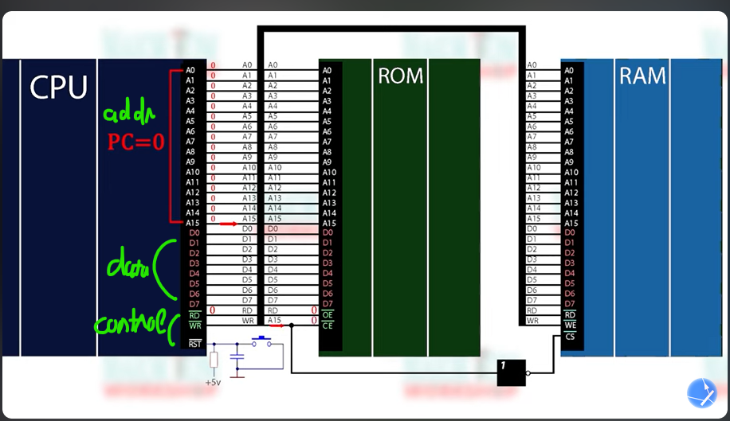

- **Interrupts:** An interrupt is a signal emitted by a device attached to a computer or from a program within the computer. It requires the operating system (OS) to stop and figure out what to do next. An interrupt temporarily stops or terminates a service or a current process.
  - Example: You press a key on keyboard, it send a signal to CPU that CPU need to read the key that being press.
  -  Each computer design has its own interrupt mechanism, but several functions are common

The form of interrupt-driven I/O  is fine for moving small amounts of data but can produce high overhead when used for bulk data movement such as NVS I/O. To solve this problem, `direct memory access (DMA)` is used. 
- After setting up buffers, pointers, and counters for the I/O device, the device controller transfers an entire block of data directly to or from the device and main memory, with no intervention by the CPU. 
- Only one interrupt is generated per block, to tell the device driver that the operation has completed, rather than the one interrupt per byte generated for low-speed devices. 
- While the device controller is performing these operations, the CPU is available to accomplish other work.

**DEFINITIONS OF COMPUTER SYSTEM COMPONENTS**
- `CPU` — The hardware that executes instructions.
- `Processor` — A physical chip that contains one or more CPUs.
- `Core` — The basic computation unit of the CPU.
- `Multicore` — Including multiple computing cores on the same CPU.
- `Multiprocessor` — Including multiple processors.

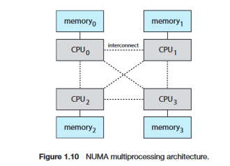

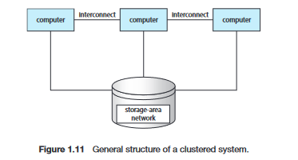

Operating-System Operations

Powered up or rebooted -> bootstrap program run -> the bootstrap program must locate the operating-system kernel and load it into memory -> the kernel is loaded and executing -> Some services are provided outside of the kernel by system programs that are loaded into memory at boot time to become `system daemons`, which run the entire time the kernel is running. -> the system is fully booted, and the system waits for some event to occur.

`System call` - is a mechanism that allows a user program to request a service from the operating system. ~  system call may generate a special kind of interrupt to switch from user mode to kernel mode

In a multiprogramming system, a program in execution is termed a process.
Multitasking is a logical extension of multiprogramming. In multitasking systems, the CPU executes multiple processes by switching among them, but the switches occur frequently, providing the user with a fast response time.

The operating system keeps several processes in memory simultaneously
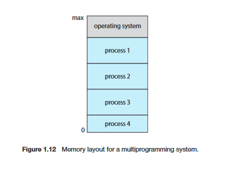

In addition, if several processes are ready to run at the same time, the system must choose which process will run next. Making this decision is `CPU scheduling`

In order to ensure the proper execution of the system, we must be able to distinguish between the execution of operating-system code and user-defined code
- user mode
- kernel mode (also called supervisor mode, system mode, or privileged mode)

A bit, called the `mode bit`, is added to the hardware of the computer to indicate the current mode: kernel (0) or user (1)

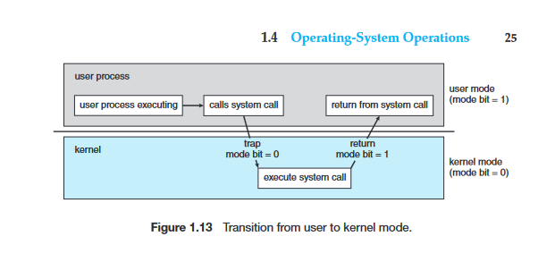

There can be more than 2 modes:
- Intel processors have four separate protection rings
- ARMv8 systems have seven modes
- CPUs that support virtualization frequently have a separate mode to indicate when the virtual machine manager (VMM) is in control of the system.

The operating system is responsible for the following activities in connection with process management:
- Creating and deleting both user and system processes
- Scheduling processes and threads on the CPUs
- Suspending and resuming processes
- Providing mechanisms for process synchronization
- Providing mechanisms for process communication

The operating system is responsible for the following activities in connection with memory management:
- Keeping track of which parts of memory are currently being used and which process is using them
- Allocating and de-allocating memory space as needed
- Deciding which processes (or parts of processes) and data to move into and out of memory

The operating system is responsible for the following activities in connection with file management:
- Creating and deleting files
- Creating and deleting directories to organize files
- Supporting primitives for manipulating files and directories
- Mapping files onto mass storage
- Backing up files on stable (nonvolatile) storage media

The operating system is responsible for the following activities in connection with secondary storage management:
- Mounting and unmounting
- Free-space management
- Storage allocation
- Disk scheduling
- Partitioning
- Protection

Cache management

Information, As it is used, it is copied into a faster storage system, from disk to memory to cache. 
- Then when the information change, it must update back from cache -> memory -> disk.

In a computing environment where only one process executes at a time, this arrangement poses no difficulties, 
-  However, in a multitasking environment, where the CPU is switched back and forth among various processes, extreme care must be taken to ensure that, if several processes wish to access A, then each of these processes will obtain the most recently updated value of A.
-  The situation becomes more complicated in a multiprocessor environment where, in addition to maintaining internal registers, each of the CPUs also contains a local cache. In such an environment, a copy of A may exist simultaneously in several caches.
   -  Cache Coherency
-  In a distributed environment, the situation becomes even more complex. In this environment, several copies (or replicas) of the same file can be kept on different computers

The I/O subsystem consists of several components:
- A memory-management component that includes buffering, caching, and
spooling
- A general device-driver interface
- Drivers for specific hardware devices

A device driver is a specialized software program that allows the operating system (OS) and applications to interact with hardware devices, such as printers, graphics cards, storage devices, network interfaces, and more.
- `driverquery` list all driver on Windows

`Protection`, then, is any mechanism for controlling the access of processes
or users to the resources defined by a computer system.

It is the job of `security` to defend a system from external and internal attacks. 
- Prevention of some of these attacks is considered an operating-system function on some systems, while other systems leave it to policy or additional software.

`Protection and security` require the system to be able to distinguish among all its users. Most operating systems maintain a list of user names and associated user identifiers (user IDs)
- group identifiers
- escalate privileges

Kernel Data Structures

Lists, Stacks, and Queues:
- In a singly linked list, each item points to its successor
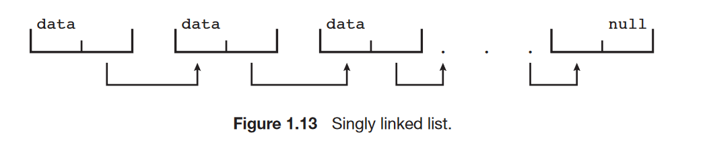

- In a doubly linked list, a given item can refer either to its predecessor orto its successor
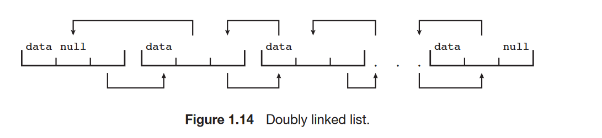

- In a circularly linked list, the last element in the list refers to the first element, rather than to null.
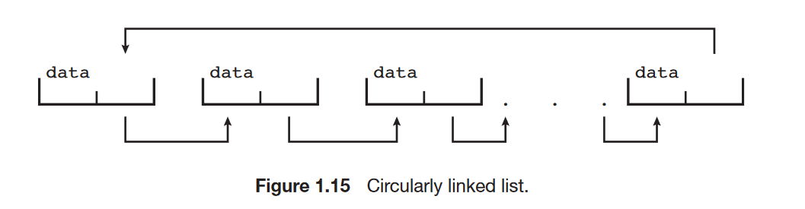

A stack is a sequentially ordered data structure that uses the last in, first
out ( LIFO) principle for adding and removing items, meaning that the last item
placed onto a stack is the first item removed

A queue, in contrast, is a sequentially ordered data structure that uses the
first in, first out (FIFO) principle: items are removed from a queue in the order
in which they were inserted.

Trees:
- general tree
- binary tree
- binary search tree

Hash Functions and Maps

Bitmaps

Computing Environments
- Traditional Computing
- Mobile Computing
- Distributed Systems
- Client – Server Computing
- Peer-to-Peer Computing
- Virtualized Computing
- Cloud Computing
- Real-Time Embedded Systems

Virtualization: Virtualization is a technology that allows operating systems to run as applications within other operating systems.

- `Public cloud` —a cloud available via the Internet to anyone willing to pay
for the services
- `Private cloud` —a cloud run by a company for that company’s own use
- `Hybrid cloud` —a cloud that includes both public and private cloud
components
- Software as a service (`SaaS`)—one or more applications (such as word
processors or spreadsheets) available via the Internet
- Platform as a service (`PaaS`)—a software stack ready for application use
via the Internet (for example, a database server)
- Infrastructure as a service (`IaaS`)—servers or storage available over the
Internet (for example, storage available for making backup copies of
production data)

# Chapter 2

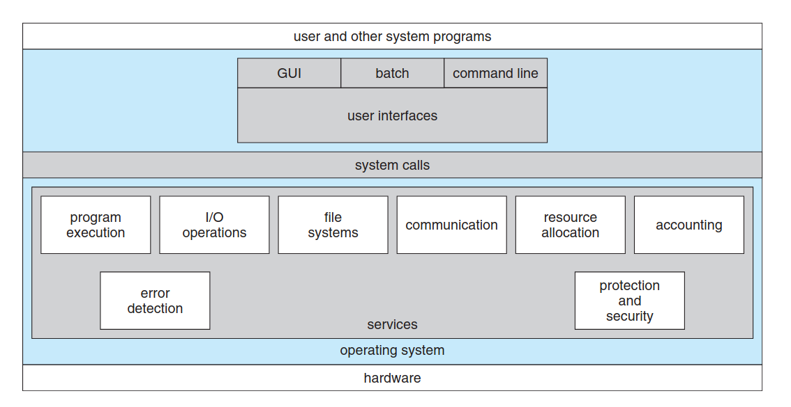

**User-Oriented Services:**

User Interface (UI): Provides ways to interact with the system:
    - Command-Line Interface (CLI): Text-based commands.
    - Batch Interface: Commands stored in files for execution.
    - Graphical User Interface (GUI): Visual interface with windows, menus, and input devices.

Program Execution:
    - Loads programs into memory, runs them, and manages normal or abnormal termination.

I/O Operations:
    - Handles input and output through files or devices, ensuring efficient and protected operations.

File-System Manipulation:
    - Provides functions to read, write, create, delete, and manage files and directories, including permissions and support for various file systems.

Communication:
    - Facilitates data exchange between processes using shared memory or message passing, either locally or over a network.

Error Detection:
    - Identifies and manages errors in hardware, devices, or software, taking actions like process termination or error reporting to maintain consistency.

**System-Oriented Services:**

Resource Allocation:
    - Distributes CPU, memory, storage, and I/O devices among multiple users or processes for efficient operation.

Accounting:
    - Tracks resource usage for billing, system optimization, and statistical analysis.

Protection and Security:
    - Controls access to system resources and safeguards against interference or unauthorized access through authentication and security mechanisms.

System calls can be grouped roughly into six major categories: 
- Process control
- File manipulation 
- Device manipulation 
- Information maintenance
- Communications 
- Protection.

Process control
- end, abort
- load, execute
- create process, terminate process
- get process attributes, set process attributes
- wait for time
- wait event, signal event
- allocate and free memory

File management
- create file, delete file
- open, close
- read, write, reposition
- get file attributes, set file attributes

Device management
- request device, release device
- read, write, reposition
- get device attributes, set device attributes
- logically attach or detach devices

Information maintenance
- get time or date, set time or date
- get system data, set system data
- get process, file, or device attributes
- set process, file, or device attributes

Communications
- create, delete communication connection
- send, receive messages
- transfer status information
- attach or detach remote devices

Communication
- message-passing model
- shared-memory model

**Message-passing model:**
- First, processes establish the connection
  - Each process identify by host name, process name 
  - OS provide system call for this, like: `get hostid()` `get processid()` `open connection()` ` close connection()` `wait for connection()`
- The source of the communication, known as the `client`, and the receiving daemon, known as a `server`
- Exchange messages by using `read_message()` and `write_message()` system calls
- The `close_connection()` call terminates the communication.

**Shared-memory model:** 
- The processes use `shared_memory_create()` and `shared_memory_attach()` system calls to create and gain access to regions of memory owned by other processes
- Shared memory requires that two or more processes agree to remove restriction '
    - The operating system usually tries to prevent one process from accessing another process’s memory

Message passing is useful for exchanging smaller amounts of data, because no conflicts need be avoided. It is also easier to implement than is shared memory for inter-computer communication. Shared memory allows maximum speed and convenience of communication, since it can be done at memory transfer speeds when it takes place within a computer.

### System Programs

Categories:
- File management.
- Status information.
- File modification.
- Programming-language support.
- Program loading and execution.
- Communications.
- Background services.

Along with system programs, most operating systems are supplied with programs that are useful in solving common problems or performing common operations. Such application programs include Web browsers, word processors and text formatters, spreadsheets, database systems, compilers, plotting and statistical-analysis packages, and games.

### Design Goals

user goals
system goals

Mechanisms and Policies

One important principle is the separation of policy from mechanism. 
Mechanisms determine how to do something; policies determine what will be done.

For example, the timer construct is a mechanism for ensuring CPU protection, 
but deciding how long the timer is to be set for a particular user is a policy decision.

## Operating-System Structure

#### Layered Approach: 

Which the operating system is broken into a number of layers (levels). The bottom layer (layer 0) is the hardware; the highest (layer N) is the user interface.

**Advantages:**
- Simplicity of construction and debugging.

**Disadvantages:**
- Because a layer can use only lower-level layers, careful planning is necessary.
- They tend to be less efficient than other types. For instance, when a user program executes an I/O operation, it executes a system call that is trapped to the I/O layer, which calls the memory-management layer, which in turn calls the CPU-scheduling layer, which is then passed to the hardware. At each layer, the parameters may be modified, data may need to be passed, and so on. Each layer adds overhead to the system call.

#### Microkernels: 

#### Modules: 

Loadable kernel modules. Here, the kernel has a set of core components and links in additional services via modules

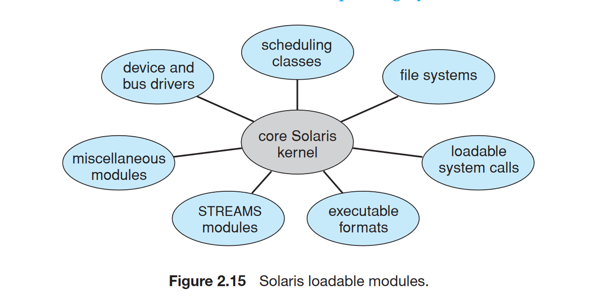

#### Hybrid Systems

In practice, very few operating systems adopt a single, strictly defined structure. Instead, they combine different structure.

### Operating-System Debugging

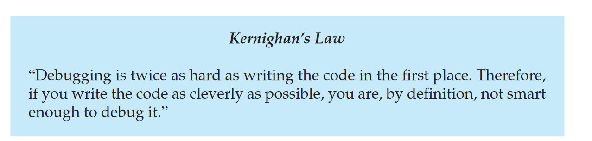

# Chapter 3

A `process` is the unit of work in a modern time-sharing system.

A system therefore consists of a collection of processes: 
- Operating-system processes executing system code
- User processes executing user code.

By switching the CPU between processes, the operating system can make the computer more productive.

A process:
- The program code ~ sometimes known as the `text section`
  - 
- Process `stack` ~ which contains temporary data (such as function parameters, return addresses, and local variables)
- `data section` ~  which contains global variables
- `heap` ~ which is memory that is dynamically allocated during process run time.

A program is a **passive** entity
A process is an **active** entity

- Two or more processes may be associated with the same program.
- It is also common to have a process that spawns many processes as it runs
  - Java runs the `JVM` as an ordinary process, which in turns executes the Java program Program in the Java virtual machine.

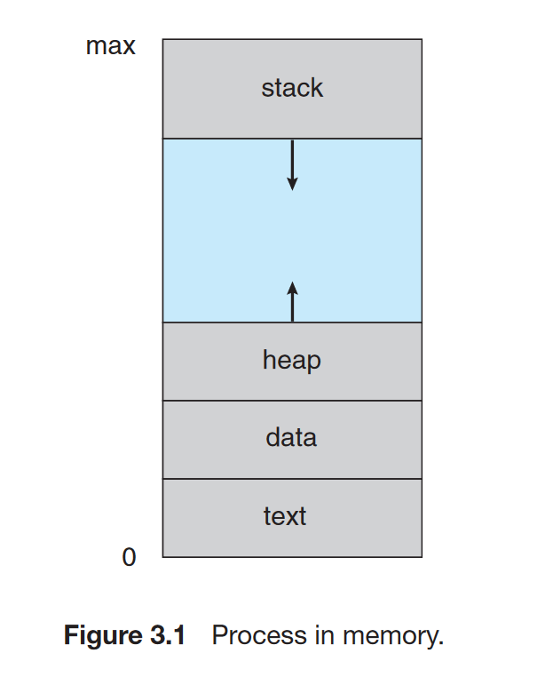

### Process State

- `New`. The process is being created.
- `Running`. Instructions are being executed.
- `Waiting`. The process is waiting for some event to occur (such as an I/O completion or reception of a signal).
- `Ready`. The process is waiting to be assigned to a processor.
- `Terminated`. The process has finished execution

These names are arbitrary, and they vary across operating systems.

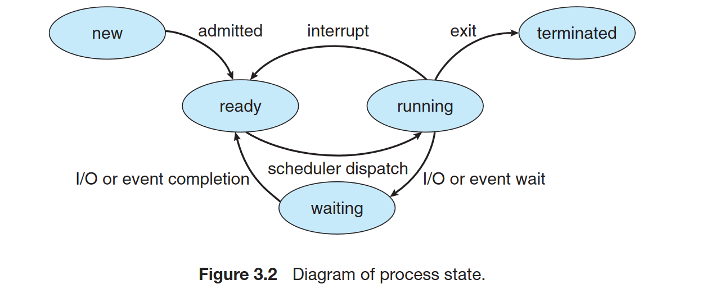

Each process is represented in the operating system by a process control block `PCB` —also called a `task control block`. In brief, the PCB simply serves as the repository for any information that may vary from process to process. `PCB` include:

- `Process state`
- `Program counter`. The counter indicates the address of the next instruction to be executed for this process.
- `CPU registers`. The registers vary in number and type, depending on the computer architecture. All info be save to allow the process to be continued correctly afterward (After interrupt).
- `CPU-scheduling` information. This information includes a process priority, pointers to scheduling queues, and any other scheduling parameters.
- `Memory-management information`. More details [Chapter 8](#chapter_8)
- `Accounting information`. This information includes the amount of CPU
and real time used, time limits, account numbers, job or process numbers,
and so on.
- `I/O status information`. This information includes the list of I/O devices
allocated to the process, a list of open files, and so on.

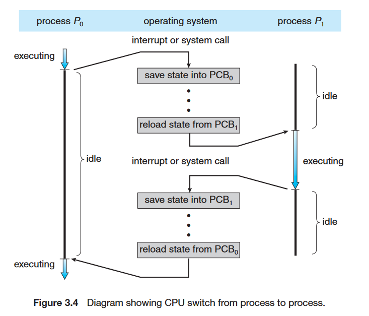

### Threads

Most modern operating systems have extended the process concept to allow a process to have multiple threads of execution and thus to perform more than one task at a time.

More details at [Chapter 4](#chapter_4)

### Process Scheduling

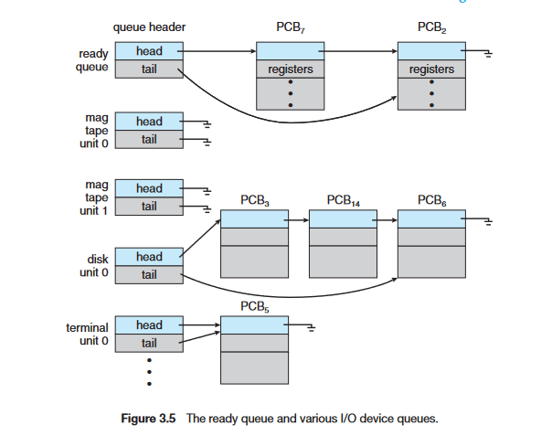

As processes enter the system -> put into a `job queue` -> Load to main memory and are ready and waiting to execute `ready queue`

The list of processes waiting for a particular I/O device is called a `device queue` 

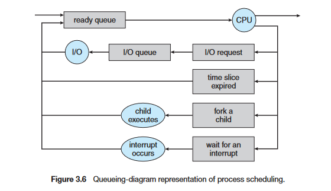

- The process could issue an I/O request and then be placed in an I/O queue.
- The process could create a new child process and wait for the child’s
termination.
- The process could be removed forcibly from the CPU, as a result of an
interrupt, and be put back in the ready queue.

### Schedulers

- The `long-term scheduler`, or `job scheduler`
-  The `short-term scheduler`, or `CPU scheduler` -> Select new process for the `CPU`
-  The primary distinction between these two schedulers lies in frequency of execution 
   - The `short-term scheduler` must be fast, quick, can't wait time much to choose process, it make `CPU` less efficiency.
   - The `long-term scheduler` may need to be invoked only when a process leaves the system. Because of the longer interval between executions, it can afford to take more time to decide which process should be selected for execution.

It is important that the `long-term scheduler` make a careful selection, these are two type of process can be consider:
- An `I/O -bound process` is one that spends more of its time doing I/O than
it spends doing computations.
- A `CPU-bound process`, in contrast, generates I/O requests infrequently, using more of its time doing computations.

Some operating systems, such as time-sharing systems, may introduce an intermediate level of scheduling. The key idea behind a `medium-term scheduler` is that sometimes it can be advantageous to remove a process from memory
- This scheme is called swapping. The process is swapped out, and is later swapped in, in the memory.

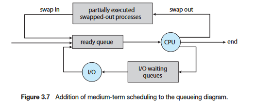

#### Context Switch

When an interrupt occurs, the system needs to save the current context of the process running on the CPU so that it can restore that context when its processing is done, essentially suspending the process and then resuming it.

- `state save` save the current state of the CPU, be it in kernel or user mode
- `state restore` to resume operations.
- `context switch` save the current state of the process and load the state of the next process to be executed.
  - `context` is the set of all the CPU registers, memory, and other data structures that define the state of a process. It save on the process PCB.

Context-switch times are highly dependent on hardware support.

### Process Creation

**Tree of processes: **
- The parent process creates a child process.
- Each of these new processes may in turn create other processes.

Most operating systems (including UNIX , Linux, and Windows) identify processes according to a unique process identifier (or `pid`)

The init process (which always has a pid of 1) serves as the root parent process for all user processes.

When a process creates a child process, that child process will need certain resources
- Obtain its resources directly from the operating system,
- Subset of the resources of the parent process
  - Restricting a child process to a subset is good because prevents any process from overloading the system by creating too many child processes.

When a process creates a new process, two possibilities for execution exist:
1. The parent continues to execute concurrently with its children.
2. The parent waits until some or all of its children have terminated.

There are also two address-space possibilities for the new process:
1. The child process is a duplicate of the parent process (it has the same program and data as the parent).
2. The child process has a new program loaded into it.

UNIX operating system:
- A new process is created by the `fork()` system call.
  - The new process consists of a copy of the address space of the original process

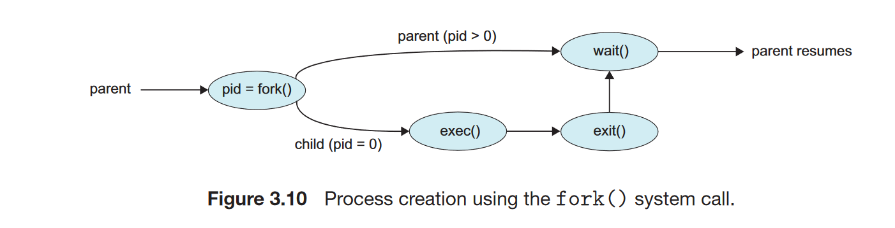

### Process Termination

When a process terminates, it releases all the resources it has allocated, including memory, I/O devices, and files.

The `exit()` system call is used to terminate a process.

The `wait()` system call is used to wait for a child process to terminate.

A parent may terminate the execution of one of its children for a variety of reasons, such as these:
- The child has exceeded its usage of some of the resources that it has been allocated. (To determine whether this has occurred, the parent must have a mechanism to inspect the state of its children.)
- The task assigned to the child is no longer required.
- The parent is exiting, and the operating system does not allow a child to continue if its parent terminates.

When a process terminates, its resources are deallocated by the OS.
- However, its entry in the process table must remain there until the parent calls `wait()`, because the process table contains the process’s exit status.
- A process that has terminated, but whose parent has not yet called wait() -> `zombie process` 
- A process that has terminated, parent has not called `wait()` and it terminated -> `orphans process`
-  Linux and UNIX deal with `orphans process` by assigning the `init` process as the new parent. The `init` process periodically invokes `wait()` allow releasing resources.

### Inter-process Communication

- Any process that does not share data with any other process is independent.
- Any process that shares data with other processes is a cooperating process.

There are several reasons for providing an environment that allows process cooperation:
- Information sharing. 
- Computation speedup.
- Modularity.
- Convenience.

Cooperating processes require an inter-process communication (`IPC`):
- Shared memory.
- Message passing.

Shared memory suffers from cache coherency issues -> message passing become more preferred mechanism for IPC.

#### Shared-Memory Systems

- The process creating the shared-memory segment. Typically, in the address space of that process.
- Other processes that wish to communicate using this shared-memory segment must attach it to their address space
- Normally, the OS tries to prevent one process from accessing another process’s
memory -> So the processes must agree to remove this restriction.

The `producer–consumer` approach:
- Have available a buffer of items that can be filled by the producer and emptied by the consumer.
- A `producer` can produce one item while the `consumer` is consuming another item
- The `producer` and `consumer` must be synchronized, so that the `consumer` does not try to consume an item that has not yet been produced.
  - `Unbounded buffer` - no limit on the size of the buffer - the producer can always produce new items.
  - `Bounded buffer` - limited - the `consumer` must wait if the buffer is empty, and the `producer` must wait if the buffer is full.

#### Message-Passing Systems

A message-passing facility provides at least two operations:
- `send` (message) 
- `receive` (message)

For 2 process can be communicate, a `communication link` must exist between them.

Here are several methods for logically implementing a link and the `send()`/`receive()` operations:
- Direct or indirect communication
- Synchronous or asynchronous communication
- Automatic or explicit buffering

**Naming**

Under direct communication, there are 2 schemes:
- Symmetric: 2 processes must know each other identities.
- Asymmetric: Just sender need to know the recipient identities

With indirect communication:
- The messages are sent to and received from mailboxes, or ports.
  - Sender send a messages to a mailbox (owned either by a process or by the operating system)
  - The recipient receive a message from mailbox.
    - Depend on the polices of the mailbox, one or more recipient can receive the messages
  - When a process that owns a mailbox terminates, the mailbox disappears. Any process that subsequently sends a message to this mailbox must be notified that the mailbox no longer exists.

**Synchronization** Message passing may be either blocking or nonblocking—
also known as synchronous and asynchronous

- `Blocking send.` The sending process is blocked until the message is
received by the receiving process or by the mailbox.
- `Nonblocking send.` The sending process sends the message and resumes
operation.
- `Blocking receive.` The receiver blocks until a message is available.
- `Nonblocking receive.` The receiver retrieves either a valid message or a null.

**Buffering** messages exchanged by communicating processes reside in a temporary queue.

- `Zero capacity.` The queue has a maximum length of zero; thus, the link
cannot have any messages waiting in it. In this case, the sender must block
until the recipient receives the message.
- `Bounded capacity.` The queue has finite length n; and the sender can continue execution without waiting. The link’s capacity is finite, however. If the link is full, the sender must block until space is available in the queue.
- `Unbounded capacity.` The queue’s length is potentially infinite; thus, any
number of messages can wait in it. The sender never blocks.

### Examples of IPC Systems

#### POSIX Shared Memory

POSIX shared memory is organized using memory-mapped files, which associate the region of shared memory with a file.

- Create a shared-memory object using the `shm_open()` system call
- Once the object is established, the `ftruncate()` function is used to configure the size of the object in bytes.
- Finally, the `mmap()` function establishes a memory-mapped file containing the shared-memory object. -> returns a pointer to the memory-mapped file that is used for accessing the shared-memory object.

#### Mach

#### Windows

Windows provides support for multiple operating environments, or `subsystems`
- The application programs can be considered `clients` of a subsystem `server`.

The message-passing facility in Windows is called the advanced local procedure call (`ALPC`)

Windows uses two types of ports: 
- Connection ports
- Communication ports.

When an `ALPC` channel is created, one of three message-passing techniques is chosen:
- For small messages (up to 256 bytes), the port’s message queue is used as intermediate storage, and the messages are copied from one process to the other.
- Larger messages must be passed through a section object, which is a region of shared memory associated with the channel.
- When the amount of data is too large to fit into a section object, an API is available that allows server processes to read and write directly into the address space of a client.

