# Operating-System-Concepts
About the Operating System Concepts book

Ref https://github.com/gg-daddy/ebooks/blob/master/Operating%20System%20Concepts%2C%209th%20Edition.pdf

Author: Abraham Silberschatz, Peter Baer Galvin, Greg Gagne

- [Operating-System-Concepts](#operating-system-concepts)
- [Chapter 1](#chapter-1)
- [Chapter 2](#chapter-2)
    - [System Programs](#system-programs)
    - [Design Goals](#design-goals)
  - [Operating-System Structure](#operating-system-structure)
      - [Layered Approach:](#layered-approach)
      - [Microkernels:](#microkernels)
      - [Modules:](#modules)
      - [Hybrid Systems](#hybrid-systems)
    - [Operating-System Debugging](#operating-system-debugging)
- [Chapter 3](#chapter-3)
    - [Process State](#process-state)
    - [Threads](#threads)
    - [Process Scheduling](#process-scheduling)
    - [Schedulers](#schedulers)
      - [Context Switch](#context-switch)
    - [Process Creation](#process-creation)
    - [Process Termination](#process-termination)
    - [Inter-process Communication](#inter-process-communication)
      - [Shared-Memory Systems](#shared-memory-systems)
      - [Message-Passing Systems](#message-passing-systems)
    - [Examples of IPC Systems](#examples-of-ipc-systems)
      - [POSIX Shared Memory](#posix-shared-memory)
      - [Mach](#mach)
      - [Windows](#windows)
    - [Communication in Client–Server Systems](#communication-in-clientserver-systems)
      - [Sockets](#sockets)
    - [Remote Procedure Call (RPC)](#remote-procedure-call-rpc)
- [Chapter 4 - Threads](#chapter-4---threads)
    - [**AMDAHL’S LAW**](#amdahls-law)
      - [Parallelism and concurrency](#parallelism-and-concurrency)
      - [User and kernel level thread](#user-and-kernel-level-thread)
    - [Thread Libraries](#thread-libraries)
      - [Pthreads](#pthreads)
      - [Windows 32 API](#windows-32-api)
      - [Java Threads](#java-threads)
    - [Implicit Threading](#implicit-threading)
      - [Thread Pools](#thread-pools)
      - [OpenMP](#openmp)
      - [Grand Central Dispatch](#grand-central-dispatch)
      - [Other Approaches](#other-approaches)
    - [Threading Issues](#threading-issues)
      - [Thread canceling](#thread-canceling)
      - [Thread-Local Storage](#thread-local-storage)
      - [Scheduler Activations](#scheduler-activations)
    - [Operating-System Examples](#operating-system-examples)
      - [Windows Threads](#windows-threads)
      - [Linux Threads](#linux-threads)
- [Chapter 5](#chapter-5)
  - [The Critical-Section Problem](#the-critical-section-problem)
  - [Peterson’s Solution](#petersons-solution)
  - [Synchronization Hardware](#synchronization-hardware)
    - [Mutex Locks](#mutex-locks)
    - [Semaphores](#semaphores)
      - [Semaphore Usage](#semaphore-usage)
      - [Semaphore Implementation](#semaphore-implementation)
      - [Deadlocks and Starvation](#deadlocks-and-starvation)
      - [Priority Inversion](#priority-inversion)
  - [Classic Problems of Synchronization](#classic-problems-of-synchronization)
    - [The Bounded-Buffer Problem](#the-bounded-buffer-problem)
    - [The Readers – Writers Problem](#the-readers--writers-problem)
    - [The Dining-Philosophers Problem](#the-dining-philosophers-problem)
  - [Monitors](#monitors)
  - [Alternative Approaches](#alternative-approaches)
  - [Synchronization Examples](#synchronization-examples)
  - [Alternative Approaches](#alternative-approaches-1)
- [Chapter 6](#chapter-6)
  - [Basic Concepts](#basic-concepts)
    - [CPU– I/O Burst Cycle](#cpu-io-burst-cycle)
    - [CPU Schedule](#cpu-schedule)
    - [Preemptive Scheduling](#preemptive-scheduling)
    - [Dispatcher](#dispatcher)
  - [Scheduling Criteria](#scheduling-criteria)
  - [Scheduling Algorithms](#scheduling-algorithms)
    - [First-Come, First-Served Scheduling](#first-come-first-served-scheduling)
    - [Shortest-Job-First Scheduling](#shortest-job-first-scheduling)
    - [Priority Scheduling](#priority-scheduling)
    - [Round-Robin Scheduling](#round-robin-scheduling)
    - [Multilevel Queue Scheduling](#multilevel-queue-scheduling)
    - [Multilevel Feedback Queue Scheduling](#multilevel-feedback-queue-scheduling)
  - [Thread Scheduling](#thread-scheduling)
    - [Contention Scope](#contention-scope)
    - [Pthread Scheduling](#pthread-scheduling)
  - [Multiple-Processor Scheduling](#multiple-processor-scheduling)
    - [Approaches to Multiple-Processor Scheduling](#approaches-to-multiple-processor-scheduling)
    - [Processor Affinity](#processor-affinity)
    - [Load Balancing](#load-balancing)
    - [Multicore Processors](#multicore-processors)
  - [Real-Time CPU Scheduling](#real-time-cpu-scheduling)
    - [Minimizing Latency](#minimizing-latency)
    - [Priority-Based Scheduling](#priority-based-scheduling)
    - [Rate-Monotonic Scheduling](#rate-monotonic-scheduling)
    - [Earliest-Deadline-First Scheduling](#earliest-deadline-first-scheduling)
    - [Proportional Share Scheduling](#proportional-share-scheduling)
    - [POSIX Real-Time Scheduling](#posix-real-time-scheduling)
  - [Operating-System Examples](#operating-system-examples-1)
    - [Linux](#linux)
    - [Windows](#windows-1)
    - [Solaris](#solaris)
  - [Algorithm Evaluation](#algorithm-evaluation)
    - [Deterministic Modeling](#deterministic-modeling)
    - [Queueing Models](#queueing-models)
    - [Simulation](#simulation)
    - [Implementation](#implementation)

# Chapter 1

`Operating systems` exist because they offer a reasonable way to solve the problem of creating a usable computing system. 
The fundamental goal of computer systems is to execute programs and to make solving user problems easier. Computer hardware is constructed toward this goal. Since bare hardware alone is not particularly easy to use, application programs are developed. These programs require certain common operations, such as those controlling the I/O devices. The common functions of controlling and allocating resources are then brought together into one piece of software: the operating system.

- System bus:
  - Address bus: to determine where it should be sent or read from
  - Control bus: to determine its operation
  - Data bus: to carry information


- **Interrupts:** An interrupt is a signal emitted by a device attached to a computer or from a program within the computer. It requires the operating system (OS) to stop and figure out what to do next. An interrupt temporarily stops or terminates a service or a current process.
  - Example: You press a key on keyboard, it send a signal to CPU that CPU need to read the key that being press.
  -  Each computer design has its own interrupt mechanism, but several functions are common

The form of interrupt-driven I/O  is fine for moving small amounts of data but can produce high overhead when used for bulk data movement such as NVS I/O. To solve this problem, `direct memory access (DMA)` is used. 
- After setting up buffers, pointers, and counters for the I/O device, the device controller transfers an entire block of data directly to or from the device and main memory, with no intervention by the CPU. 
- Only one interrupt is generated per block, to tell the device driver that the operation has completed, rather than the one interrupt per byte generated for low-speed devices. 
- While the device controller is performing these operations, the CPU is available to accomplish other work.

**DEFINITIONS OF COMPUTER SYSTEM COMPONENTS**
- `CPU` — The hardware that executes instructions.
- `Processor` — A physical chip that contains one or more CPUs.
- `Core` — The basic computation unit of the CPU.
- `Multicore` — Including multiple computing cores on the same CPU.
- `Multiprocessor` — Including multiple processors.


Operating-System Operations

Powered up or rebooted -> bootstrap program run -> the bootstrap program must locate the operating-system kernel and load it into memory -> the kernel is loaded and executing -> Some services are provided outside of the kernel by system programs that are loaded into memory at boot time to become `system daemons`, which run the entire time the kernel is running. -> the system is fully booted, and the system waits for some event to occur.


`System call` - is a mechanism that allows a user program to request a service from the operating system. ~  system call may generate a special kind of interrupt to switch from user mode to kernel mode

In a multiprogramming system, a program in execution is termed a process.
Multitasking is a logical extension of multiprogramming. In multitasking systems, the CPU executes multiple processes by switching among them, but the switches occur frequently, providing the user with a fast response time.

The operating system keeps several processes in memory simultaneously


In addition, if several processes are ready to run at the same time, the system must choose which process will run next. Making this decision is `CPU scheduling`

In order to ensure the proper execution of the system, we must be able to distinguish between the execution of operating-system code and user-defined code
- user mode
- kernel mode (also called supervisor mode, system mode, or privileged mode)

A bit, called the `mode bit`, is added to the hardware of the computer to indicate the current mode: kernel (0) or user (1)


There can be more than 2 modes:
- Intel processors have four separate protection rings
- ARMv8 systems have seven modes
- CPUs that support virtualization frequently have a separate mode to indicate when the virtual machine manager (VMM) is in control of the system.

The operating system is responsible for the following activities in connection with process management:
- Creating and deleting both user and system processes
- Scheduling processes and threads on the CPUs
- Suspending and resuming processes
- Providing mechanisms for process synchronization
- Providing mechanisms for process communication

The operating system is responsible for the following activities in connection with memory management:
- Keeping track of which parts of memory are currently being used and which process is using them
- Allocating and de-allocating memory space as needed
- Deciding which processes (or parts of processes) and data to move into and out of memory

The operating system is responsible for the following activities in connection with file management:
- Creating and deleting files
- Creating and deleting directories to organize files
- Supporting primitives for manipulating files and directories
- Mapping files onto mass storage
- Backing up files on stable (nonvolatile) storage media

The operating system is responsible for the following activities in connection with secondary storage management:
- Mounting and unmounting
- Free-space management
- Storage allocation
- Disk scheduling
- Partitioning
- Protection

Cache management

Information, As it is used, it is copied into a faster storage system, from disk to memory to cache. 
- Then when the information change, it must update back from cache -> memory -> disk.

In a computing environment where only one process executes at a time, this arrangement poses no difficulties, 
-  However, in a multitasking environment, where the CPU is switched back and forth among various processes, extreme care must be taken to ensure that, if several processes wish to access A, then each of these processes will obtain the most recently updated value of A.
-  The situation becomes more complicated in a multiprocessor environment where, in addition to maintaining internal registers, each of the CPUs also contains a local cache. In such an environment, a copy of A may exist simultaneously in several caches.
   -  Cache Coherency
-  In a distributed environment, the situation becomes even more complex. In this environment, several copies (or replicas) of the same file can be kept on different computers


The I/O subsystem consists of several components:
- A memory-management component that includes buffering, caching, and
spooling
- A general device-driver interface
- Drivers for specific hardware devices

A device driver is a specialized software program that allows the operating system (OS) and applications to interact with hardware devices, such as printers, graphics cards, storage devices, network interfaces, and more.
- `driverquery` list all driver on Windows


`Protection`, then, is any mechanism for controlling the access of processes
or users to the resources defined by a computer system.

It is the job of `security` to defend a system from external and internal attacks. 
- Prevention of some of these attacks is considered an operating-system function on some systems, while other systems leave it to policy or additional software.

`Protection and security` require the system to be able to distinguish among all its users. Most operating systems maintain a list of user names and associated user identifiers (user IDs)
- group identifiers
- escalate privileges

Kernel Data Structures

Lists, Stacks, and Queues:
- In a singly linked list, each item points to its successor


- In a doubly linked list, a given item can refer either to its predecessor orto its successor


- In a circularly linked list, the last element in the list refers to the first element, rather than to null.


A stack is a sequentially ordered data structure that uses the last in, first
out ( LIFO) principle for adding and removing items, meaning that the last item
placed onto a stack is the first item removed

A queue, in contrast, is a sequentially ordered data structure that uses the
first in, first out (FIFO) principle: items are removed from a queue in the order
in which they were inserted.

Trees:
- general tree
- binary tree
- binary search tree

Hash Functions and Maps

Bitmaps

Computing Environments
- Traditional Computing
- Mobile Computing
- Distributed Systems
- Client – Server Computing
- Peer-to-Peer Computing
- Virtualized Computing
- Cloud Computing
- Real-Time Embedded Systems

Virtualization: Virtualization is a technology that allows operating systems to run as applications within other operating systems.

- `Public cloud` —a cloud available via the Internet to anyone willing to pay
for the services
- `Private cloud` —a cloud run by a company for that company’s own use
- `Hybrid cloud` —a cloud that includes both public and private cloud
components
- Software as a service (`SaaS`)—one or more applications (such as word
processors or spreadsheets) available via the Internet
- Platform as a service (`PaaS`)—a software stack ready for application use
via the Internet (for example, a database server)
- Infrastructure as a service (`IaaS`)—servers or storage available over the
Internet (for example, storage available for making backup copies of
production data)

# Chapter 2


**User-Oriented Services:**

User Interface (UI): Provides ways to interact with the system:
    - Command-Line Interface (CLI): Text-based commands.
    - Batch Interface: Commands stored in files for execution.
    - Graphical User Interface (GUI): Visual interface with windows, menus, and input devices.

Program Execution:
    - Loads programs into memory, runs them, and manages normal or abnormal termination.

I/O Operations:
    - Handles input and output through files or devices, ensuring efficient and protected operations.

File-System Manipulation:
    - Provides functions to read, write, create, delete, and manage files and directories, including permissions and support for various file systems.

Communication:
    - Facilitates data exchange between processes using shared memory or message passing, either locally or over a network.

Error Detection:
    - Identifies and manages errors in hardware, devices, or software, taking actions like process termination or error reporting to maintain consistency.

**System-Oriented Services:**

Resource Allocation:
  - Distributes CPU, memory, storage, and I/O devices among multiple users or processes for efficient operation.

Accounting:
  - Tracks resource usage for billing, system optimization, and statistical analysis.

Protection and Security:
  - Controls access to system resources and safeguards against interference or unauthorized access through authentication and security mechanisms.

System calls can be grouped roughly into six major categories: 
- Process control
- File manipulation 
- Device manipulation 
- Information maintenance
- Communications 
- Protection.

Process control
- end, abort
- load, execute
- create process, terminate process
- get process attributes, set process attributes
- wait for time
- wait event, signal event
- allocate and free memory

File management
- create file, delete file
- open, close
- read, write, reposition
- get file attributes, set file attributes

Device management
- request device, release device
- read, write, reposition
- get device attributes, set device attributes
- logically attach or detach devices

Information maintenance
- get time or date, set time or date
- get system data, set system data
- get process, file, or device attributes
- set process, file, or device attributes

Communications
- create, delete communication connection
- send, receive messages
- transfer status information
- attach or detach remote devices


Communication
- message-passing model
- shared-memory model

**Message-passing model:**
- First, processes establish the connection
  - Each process identify by host name, process name 
  - OS provide system call for this, like: `get hostid()` `get processid()` `open connection()` ` close connection()` `wait for connection()`
- The source of the communication, known as the `client`, and the receiving daemon, known as a `server`
- Exchange messages by using `read_message()` and `write_message()` system calls
- The `close_connection()` call terminates the communication.

**Shared-memory model:** 
- The processes use `shared_memory_create()` and `shared_memory_attach()` system calls to create and gain access to regions of memory owned by other processes
- Shared memory requires that two or more processes agree to remove restriction '
    - The operating system usually tries to prevent one process from accessing another process’s memory

Message passing is useful for exchanging smaller amounts of data, because no conflicts need be avoided. It is also easier to implement than is shared memory for inter-computer communication. Shared memory allows maximum speed and convenience of communication, since it can be done at memory transfer speeds when it takes place within a computer.

### System Programs

Categories:
- File management.
- Status information.
- File modification.
- Programming-language support.
- Program loading and execution.
- Communications.
- Background services.

Along with system programs, most operating systems are supplied with programs that are useful in solving common problems or performing common operations. Such application programs include Web browsers, word processors and text formatters, spreadsheets, database systems, compilers, plotting and statistical-analysis packages, and games.

### Design Goals

user goals
system goals

Mechanisms and Policies

One important principle is the separation of policy from mechanism. 
Mechanisms determine how to do something; policies determine what will be done.

For example, the timer construct is a mechanism for ensuring CPU protection, 
but deciding how long the timer is to be set for a particular user is a policy decision.

## Operating-System Structure

#### Layered Approach: 

Which the operating system is broken into a number of layers (levels). The bottom layer (layer 0) is the hardware; the highest (layer N) is the user interface.

**Advantages:**
- Simplicity of construction and debugging.

**Disadvantages:**
- Because a layer can use only lower-level layers, careful planning is necessary.
- They tend to be less efficient than other types. For instance, when a user program executes an I/O operation, it executes a system call that is trapped to the I/O layer, which calls the memory-management layer, which in turn calls the CPU-scheduling layer, which is then passed to the hardware. At each layer, the parameters may be modified, data may need to be passed, and so on. Each layer adds overhead to the system call.

#### Microkernels: 

#### Modules: 

Loadable kernel modules. Here, the kernel has a set of core components and links in additional services via modules


#### Hybrid Systems

In practice, very few operating systems adopt a single, strictly defined structure. Instead, they combine different structure.

### Operating-System Debugging


# Chapter 3

A `process` is the unit of work in a modern time-sharing system.

A system therefore consists of a collection of processes: 
- Operating-system processes executing system code
- User processes executing user code.

By switching the CPU between processes, the operating system can make the computer more productive.

A process:
- The program code ~ sometimes known as the `text section`
  - 
- Process `stack` ~ which contains temporary data (such as function parameters, return addresses, and local variables)
- `data section` ~  which contains global variables
- `heap` ~ which is memory that is dynamically allocated during process run time.

A program is a **passive** entity
A process is an **active** entity

- Two or more processes may be associated with the same program.
- It is also common to have a process that spawns many processes as it runs
  - Java runs the `JVM` as an ordinary process, which in turns executes the Java program Program in the Java virtual machine.


### Process State

- `New`. The process is being created.
- `Running`. Instructions are being executed.
- `Waiting`. The process is waiting for some event to occur (such as an I/O completion or reception of a signal).
- `Ready`. The process is waiting to be assigned to a processor.
- `Terminated`. The process has finished execution

These names are arbitrary, and they vary across operating systems.


Each process is represented in the operating system by a process control block `PCB` —also called a `task control block`. In brief, the PCB simply serves as the repository for any information that may vary from process to process. `PCB` include:

- `Process state`
- `Program counter`. The counter indicates the address of the next instruction to be executed for this process.
- `CPU registers`. The registers vary in number and type, depending on the computer architecture. All info be save to allow the process to be continued correctly afterward (After interrupt).
- `CPU-scheduling` information. This information includes a process priority, pointers to scheduling queues, and any other scheduling parameters.
- `Memory-management information`. More details [Chapter 8](#chapter_8)
- `Accounting information`. This information includes the amount of CPU
and real time used, time limits, account numbers, job or process numbers,
and so on.
- `I/O status information`. This information includes the list of I/O devices
allocated to the process, a list of open files, and so on.


### Threads

Most modern operating systems have extended the process concept to allow a process to have multiple threads of execution and thus to perform more than one task at a time.

More details at [Chapter 4](#chapter_4)

### Process Scheduling


As processes enter the system -> put into a `job queue` -> Load to main memory and are ready and waiting to execute `ready queue`

The list of processes waiting for a particular I/O device is called a `device queue` 


- The process could issue an I/O request and then be placed in an I/O queue.
- The process could create a new child process and wait for the child’s
termination.
- The process could be removed forcibly from the CPU, as a result of an
interrupt, and be put back in the ready queue.

### Schedulers

- The `long-term scheduler`, or `job scheduler`
-  The `short-term scheduler`, or `CPU scheduler` -> Select new process for the `CPU`
-  The primary distinction between these two schedulers lies in frequency of execution 
   - The `short-term scheduler` must be fast, quick, can't wait time much to choose process, it make `CPU` less efficiency.
   - The `long-term scheduler` may need to be invoked only when a process leaves the system. Because of the longer interval between executions, it can afford to take more time to decide which process should be selected for execution.


It is important that the `long-term scheduler` make a careful selection, these are two type of process can be consider:
- An `I/O -bound process` is one that spends more of its time doing I/O than
it spends doing computations.
- A `CPU-bound process`, in contrast, generates I/O requests infrequently, using more of its time doing computations.

Some operating systems, such as time-sharing systems, may introduce an intermediate level of scheduling. The key idea behind a `medium-term scheduler` is that sometimes it can be advantageous to remove a process from memory
- This scheme is called swapping. The process is swapped out, and is later swapped in, in the memory.


#### Context Switch

When an interrupt occurs, the system needs to save the current context of the process running on the CPU so that it can restore that context when its processing is done, essentially suspending the process and then resuming it.

- `state save` save the current state of the CPU, be it in kernel or user mode
- `state restore` to resume operations.
- `context switch` save the current state of the process and load the state of the next process to be executed.
  - `context` is the set of all the CPU registers, memory, and other data structures that define the state of a process. It save on the process PCB.

Context-switch times are highly dependent on hardware support.

### Process Creation

**Tree of processes: **
- The parent process creates a child process.
- Each of these new processes may in turn create other processes.

Most operating systems (including UNIX , Linux, and Windows) identify processes according to a unique process identifier (or `pid`)

The init process (which always has a pid of 1) serves as the root parent process for all user processes.

When a process creates a child process, that child process will need certain resources
- Obtain its resources directly from the operating system,
- Subset of the resources of the parent process
  - Restricting a child process to a subset is good because prevents any process from overloading the system by creating too many child processes.

When a process creates a new process, two possibilities for execution exist:
1. The parent continues to execute concurrently with its children.
2. The parent waits until some or all of its children have terminated.

There are also two address-space possibilities for the new process:
1. The child process is a duplicate of the parent process (it has the same program and data as the parent).
2. The child process has a new program loaded into it.

UNIX operating system:
- A new process is created by the `fork()` system call.
  - The new process consists of a copy of the address space of the original process


### Process Termination

When a process terminates, it releases all the resources it has allocated, including memory, I/O devices, and files.

The `exit()` system call is used to terminate a process.

The `wait()` system call is used to wait for a child process to terminate.

A parent may terminate the execution of one of its children for a variety of reasons, such as these:
- The child has exceeded its usage of some of the resources that it has been allocated. (To determine whether this has occurred, the parent must have a mechanism to inspect the state of its children.)
- The task assigned to the child is no longer required.
- The parent is exiting, and the operating system does not allow a child to continue if its parent terminates.

When a process terminates, its resources are deallocated by the OS.
- However, its entry in the process table must remain there until the parent calls `wait()`, because the process table contains the process’s exit status.
- A process that has terminated, but whose parent has not yet called wait() -> `zombie process` 
- A process that has terminated, parent has not called `wait()` and it terminated -> `orphans process`
-  Linux and UNIX deal with `orphans process` by assigning the `init` process as the new parent. The `init` process periodically invokes `wait()` allow releasing resources.

### Inter-process Communication

- Any process that does not share data with any other process is independent.
- Any process that shares data with other processes is a cooperating process.

There are several reasons for providing an environment that allows process cooperation:
- Information sharing. 
- Computation speedup.
- Modularity.
- Convenience.

Cooperating processes require an inter-process communication (`IPC`):
- Shared memory.
- Message passing.


Shared memory suffers from cache coherency issues -> message passing become more preferred mechanism for IPC.

#### Shared-Memory Systems

- The process creating the shared-memory segment. Typically, in the address space of that process.
- Other processes that wish to communicate using this shared-memory segment must attach it to their address space
- Normally, the OS tries to prevent one process from accessing another process’s
memory -> So the processes must agree to remove this restriction.

The `producer–consumer` approach:
- Have available a buffer of items that can be filled by the producer and emptied by the consumer.
- A `producer` can produce one item while the `consumer` is consuming another item
- The `producer` and `consumer` must be synchronized, so that the `consumer` does not try to consume an item that has not yet been produced.
  - `Unbounded buffer` - no limit on the size of the buffer - the producer can always produce new items.
  - `Bounded buffer` - limited - the `consumer` must wait if the buffer is empty, and the `producer` must wait if the buffer is full.

#### Message-Passing Systems

A message-passing facility provides at least two operations:
- `send` (message) 
- `receive` (message)

For 2 process can be communicate, a `communication link` must exist between them.

Here are several methods for logically implementing a link and the `send()`/`receive()` operations:
- Direct or indirect communication
- Synchronous or asynchronous communication
- Automatic or explicit buffering

**Naming**

Under direct communication, there are 2 schemes:
- Symmetric: 2 processes must know each other identities.
- Asymmetric: Just sender need to know the recipient identities

With indirect communication:
- The messages are sent to and received from mailboxes, or ports.
  - Sender send a messages to a mailbox (owned either by a process or by the operating system)
  - The recipient receive a message from mailbox.
    - Depend on the polices of the mailbox, one or more recipient can receive the messages
  - When a process that owns a mailbox terminates, the mailbox disappears. Any process that subsequently sends a message to this mailbox must be notified that the mailbox no longer exists.

**Synchronization** Message passing may be either blocking or nonblocking—
also known as synchronous and asynchronous

- `Blocking send.` The sending process is blocked until the message is
received by the receiving process or by the mailbox.
- `Nonblocking send.` The sending process sends the message and resumes
operation.
- `Blocking receive.` The receiver blocks until a message is available.
- `Nonblocking receive.` The receiver retrieves either a valid message or a null.

**Buffering** messages exchanged by communicating processes reside in a temporary queue.

- `Zero capacity.` The queue has a maximum length of zero; thus, the link
cannot have any messages waiting in it. In this case, the sender must block
until the recipient receives the message.
- `Bounded capacity.` The queue has finite length n; and the sender can continue execution without waiting. The link’s capacity is finite, however. If the link is full, the sender must block until space is available in the queue.
- `Unbounded capacity.` The queue’s length is potentially infinite; thus, any
number of messages can wait in it. The sender never blocks.

### Examples of IPC Systems

#### POSIX Shared Memory

POSIX shared memory is organized using memory-mapped files, which associate the region of shared memory with a file.

- Create a shared-memory object using the `shm_open()` system call
- Once the object is established, the `ftruncate()` function is used to configure the size of the object in bytes.
- Finally, the `mmap()` function establishes a memory-mapped file containing the shared-memory object. -> returns a pointer to the memory-mapped file that is used for accessing the shared-memory object.

#### Mach

#### Windows

Windows provides support for multiple operating environments, or `subsystems`
- The application programs can be considered `clients` of a subsystem `server`.

The message-passing facility in Windows is called the advanced local procedure call (`ALPC`)

Windows uses two types of ports: 
- Connection ports
- Communication ports.

When an `ALPC` channel is created, one of three message-passing techniques is chosen:
- For small messages (up to 256 bytes), the port’s message queue is used as intermediate storage, and the messages are copied from one process to the other.
- Larger messages must be passed through a section object, which is a region of shared memory associated with the channel.
- When the amount of data is too large to fit into a section object, an API is available that allows server processes to read and write directly into the address space of a client.


### Communication in Client–Server Systems

The client–server communication: sockets, remote procedure calls (RPCs), and pipes. These are similar technic with shared memory and message passing

#### Sockets

1. **Definition**:
   - A socket is an endpoint for communication in a network, identified by an IP address and port number.

2. **Client-Server Architecture**:
   - The **server** listens on a specific port, waiting for client requests.
   - The **client** initiates a connection using an arbitrary port (greater than 1024).

3. **Well-Known Ports**:
   - Ports below 1024 are reserved for standard services:
     - Telnet: Port 23
     - FTP: Port 21
     - HTTP: Port 80

4. **Connection Example**:
   - A client at IP `146.86.5.20` with port `1625` connects to a web server at IP `161.25.19.8` on port `80`.
   - The connection is defined by the unique socket pair: `(146.86.5.20:1625)` and `(161.25.19.8:80)`.

5. **Unique Connections**:
   - Each connection must have a unique socket pair.
   - If another client process connects to the same server, it will use a different port number (greater than 1024) to ensure uniqueness.

### Remote Procedure Call (RPC)

1. **Definition**:
   - RPC abstracts the procedure-call mechanism for use between systems over a network.
   - Built on message-based communication, enabling processes on separate systems to interact.

2. **Structure**:
   - RPC messages are well-structured, containing:
     - An identifier specifying the function to execute.
     - Parameters for the function.
   - Addressed to an RPC daemon listening on a specific port.

3. **Ports**:
   - Systems use ports to differentiate network services.
   - Example: A server providing a list of current users may attach this RPC service to port 3027.

4. **Stubs and Parameter Marshalling**:
   - **Stub**:
     - A client-side stub hides communication details, locates the server port, and packages parameters.
     - The server-side stub receives the message, unmarshals the data, and invokes the procedure.
   - **Parameter Marshalling**:
     - Converts machine-dependent data into a machine-independent representation (e.g., XDR) for transmission.

5. **Data Representation**:
   - Differences in data representation (e.g., big-endian vs. little-endian) are resolved using a machine-independent format like XDR.

6. **Reliability**:
   - **"At Most Once" Semantics**:
     - Ensures duplicate messages are ignored using timestamps.
   - **"Exactly Once" Semantics**:
     - Uses acknowledgments (ACKs) to confirm message receipt and execution, resending calls if needed.

7. **Binding**:
   - Binding between client and server may occur at link, load, or execution time to establish communication.

# Chapter 4 - Threads

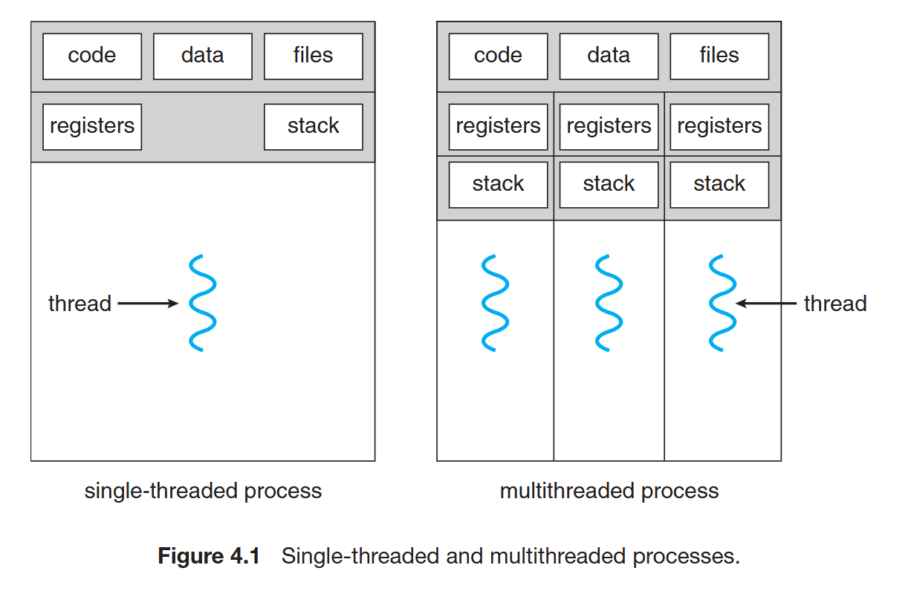

**Benefits:**
- **Responsiveness:** Multithreading an interactive application may allow a program to continue running even if part of it is blocked or is performing a lengthy operation, thereby increasing responsiveness to the user.
- **Resource sharing:** threads share the memory and the resources of the process to which they belong by default. The benefit of sharing code and data is that it allows an application to have several different threads of activity within the same address space
- **Economy:** Allocating memory and resources for `process` creation is costly. The threads share the resources of the process to which they belong, it is more economical to create and context-switch threads.
- **Scalability:** The threads may be running in parallel on different processing cores. A single-threaded process can run on only one processor, regardless how many are available. 

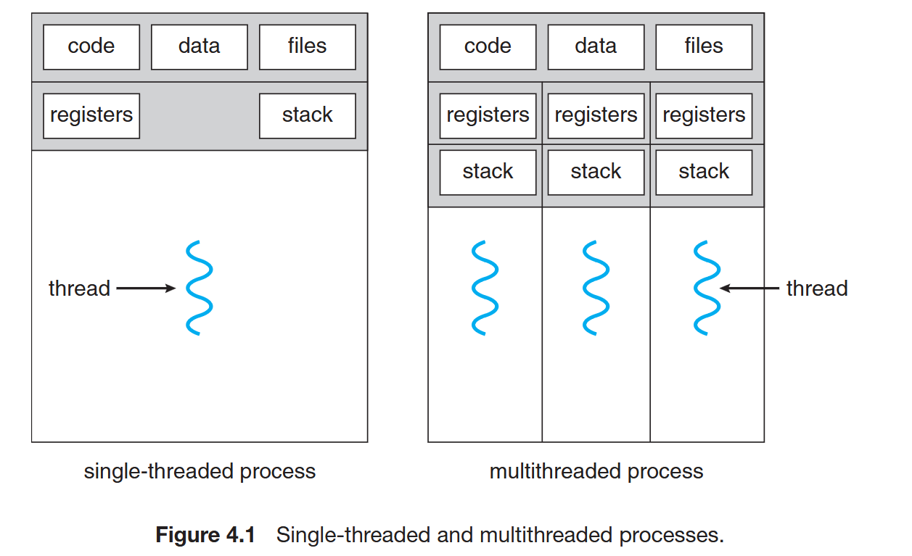

### **AMDAHL’S LAW**

Amdahl's Law is a principle in computer science that quantifies the performance improvement in a system when parts of it are optimized, particularly in parallel computing. It demonstrates how the speedup of a program using multiple processors is limited by the portion of the program that cannot be parallelized.

**Formula:**
\[
S = \frac{1}{(1 - P) + \frac{P}{N}}
\]

**Where:**
- **S**: The overall speedup of the program.
- **P**: The proportion of the program that can be parallelized.
- **(1 - P)**: The proportion of the program that is sequential (cannot be parallelized).
- **N**: The number of processors or parallel units.

**Key Insights:**
1. **Sequential Limitation**: No matter how many processors are added, the speedup is constrained by the sequential portion of the program.
2. **Diminishing Returns**: As **N** (the number of processors) increases, the incremental speedup decreases due to the dominance of the sequential portion.

**Practical Implications:**
- `Amdahl's Law` emphasizes minimizing the sequential part of a program to maximize performance gains in parallel computing.
- It highlights that even with infinite processors, the maximum speedup is \(\frac{1}{1-P}\).

**Example:**
If 70% (\(P = 0.7\)) of a program can be parallelized, and there are 4 processors (\(N = 4\)):

\[
S = \frac{1}{(1 - 0.7) + \frac{0.7}{4}} = \frac{1}{0.3 + 0.175} = 2.5
\]

The speedup is 2.5 times the original performance.

**Conclusion:**
`Amdahl's Law` is critical for understanding the scalability limits of parallel processing systems and underscores the importance of reducing the sequential components of a program to achieve better performance.


#### Parallelism and concurrency 

- A system is parallel if it can perform more than one task simultaneously.
- A concurrent system supports more than one task by allowing all
the tasks to make progress

**Types of Parallelism:**
- Data parallelism
- Task parallelism

#### User and kernel level thread 
- User threads: Supported above the kernel and are managed without kernel support
- Kernel threads: Supported and managed directly by the operating system.

Ref: https://stackoverflow.com/questions/10386815/stdthreads-are-managed-in-user-or-kernel-space


A user level thread's scheduling is maintained by the user himself (via the interface provided by a library) and the kernel ends up allotting just a single kernel thread to the whole process. Kernel would treat the process as a single threaded and any blocking call by one of the threads would end up blocking all the threads of that process. Refer to http://www.personal.kent.edu/~rmuhamma/OpSystems/Myos/threads.htm

**Multithreading Models:**
- Many-to-One Model
- One-to-One Model
- Many-to-Many Model

### Thread Libraries

**Popular:**
- POSIX Pthreads
- Windows
- Java

**Note:**
- For POSIX and Windows threading, any data declared globally -> shared among all threads belonging to the same process. 
- Because Java has no notion of global data, access to shared data must be explicitly arranged between threads. Data declared local to a function are typically stored on the stack. Since each thread has its own stack, each thread has its own copy of local data.

**Asynchronous threading and synchronous threading:**

- With `asynchronous threading`, once the parent creates a child thread, the parent resumes its execution, so that the parent and child execute concurrently. Each thread runs independently of every other thread, and the parent thread need not know when its child terminates. Because the threads are independent, there is typically little data sharing between threads.

- `Synchronous threading` occurs when the parent thread creates one or more children and then must wait for all of its children to terminate before it resumes the so-called `fork`-`join` strategy. Here, the threads created by the parent perform work concurrently, but the parent cannot continue until this work has been completed. Once each thread has finished its work, it terminates and joins with its parent. Only after all of the children have joined can the parent resume execution. Typically, synchronous threading involves significant data sharing among threads. 

#### Pthreads

Provided as either a user-level or a kernel-level library. 


#### Windows 32 API

Windows thread library is a kernel-level library

#### Java Threads

### Implicit Threading 

Transfer the creation and management of threading from application developers to compilers and run-time libraries.

#### Thread Pools

- Create a number of threads at process startup and place them into a pool.
- Thread wait for work.
- When a server receives a request, it awakens a thread from this pool
  - If one is available -> passes it the request for service.
  - Once the thread completes its service, it returns to the pool and awaits more work.

Thread pools offer these benefits:
1. Servicing a request with an existing thread is faster than waiting to create a thread.
2. A thread pool limits the number of threads that exist at any one point.
  - This is particularly important on systems that cannot support a large number of concurrent threads.
3. Separating the task to be performed from the mechanics of creating the task allows us to use different strategies for running the task.

#### OpenMP

OpenMP is a set of compiler directives as well as an API for programs written in C, C++, or FORTRAN that provides support for parallel programming in shared-memory environments.

Open MP identifies parallel regions as blocks of code that may run in parallel.

Application developers insert compiler directives into their code at parallel regions, and these directives instruct the OpenMP run-time library to execute the region in parallel.

#### Grand Central Dispatch

Just like OpenMP, but Apple develop for IOS and MacOS

[Example](./Code/Chapter_4/Example/omp.c)

#### Other Approaches
- Intel threading block
- Other java API
- Other Windows API

### Threading Issues

`fork()` and `exec()`

- `fork()` can have 2 mode 
    - Duplicate all process
    - Only duplicate the process that call `fork()`
- `exec()` also have 2 mode
    - Replace all thread
    - Replace the thread that call `exec()`, other thread will not be replace

**Signal handing:**

Signal handling pattern:
- A Signal is generated by the occurrence of paiticular event.
- The signal is delivered to a process
- Once delivered, the signal must be handled.

A signal may be handle by one of two possible handle:
- A default signal handler
- A user-defined signal handler

Options to deliver signal:
- Deliver the signal to the thread that signal apply
- Deliver the signal to all thread in the process
- Deliver the signal to certain thread in the process
- Assign the specific thread that handle the signal

Windows does not explicitly provide support for signals, it allows us to emulate them using `asynchronous procedure calls (APC s)`

#### Thread canceling

- Asynchronous cancellation: One thread immediately terminates the target thread
- Deferred cancellation: The target thread periodically checks whether it should terminate, allow it have opportunity to terminates itself in an orderly way.


The difficulty with cancellation occurs in situations where resources have been allocated to a canceled thread or where a thread is canceled while in the midst of updating data it is sharing with other threads.
  - In some case, canceling a thread asynchronously may not free a necessary system-wide resource.


Pthreads supports three cancellation modes.

| Mode         | State    | Type         |
| ------------ | -------- | ------------ |
| Off          | Disabled | –            |
| Deferred     | Enabled  | Deferred     |
| Asynchronous | Enabled  | Asynchronous |

`Pthreads` allows threads to `disable` or `enable` cancellation
  - A thread cannot be canceled if cancellation is disabled.
  - The default cancellation type is deferred cancellation. Here, cancellation occurs only when a thread reaches a `cancellation point`.

#### Thread-Local Storage

`thread-local storage ` The thread's own copy of certain data.

#### Scheduler Activations

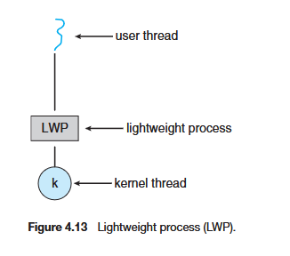

To the `user-thread` library, the LWP appears to be a virtual processor on which the application can schedule a user thread to run. Each LWP is attached to a kernel thread, and it is kernel threads that the operating system schedules to run on physical processors.

One scheme for communication between the user-thread library and the kernel is known as `scheduler activation`. It manage the schedule for user threads onto an available virtual processor. This communication procedure is known as an `upcall`. `Upcalls` are handled by the thread library with an `upcall handler`.

### Operating-System Examples

#### Windows Threads

The general components of a thread include:
- A thread ID uniquely identifying the thread
- A register set representing the status of the processor
- A user stack, employed when the thread is running in user mode, and a kernel stack, employed when the thread is running in kernel mode.
- A private storage area used by various run-time libraries and dynamic link libraries (DLLs).

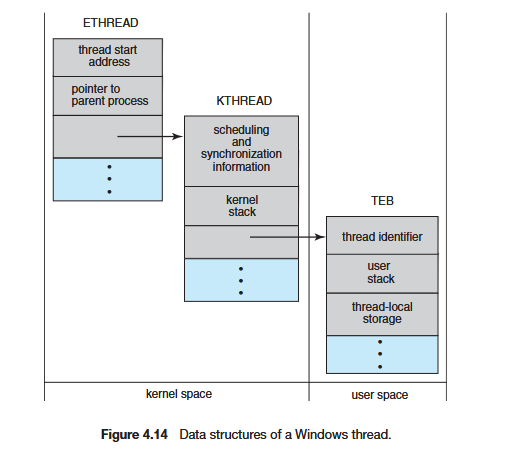

#### Linux Threads

Linux does not distinguish between `processes` and `threads`. In fact, Linux uses the term task rather than `process` or `thread`.

Linux also provides the ability to create threads using the `clone()` system call.

When `clone()` is invoked, it is passed a set of flags that determine how much sharing is to take place between the `parent` and `child` tasks.

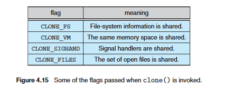

If none of these flags is set when `clone()` is invoked, no sharing takes place, resulting in functionality similar to that provided by the `fork()` system call.

- When `fork()` is invoked, a new task is created, along with a copy of all the associated data structures of the parent process.

- When `clone()` is invoked,  rather than copying all data structures, the new task **points** to the data structures of the parent task, depending on the set of flags passed to `clone()`

# Chapter 5

Process Synchronization: Discuss various mechanisms to ensure the orderly execution of cooperating processes that share a logical address space, so that data consistency is maintained

A `cooperating process` is one that can affect or be affected by other processes executing in the system.

`Race condition` ~ several processes access and manipulate the same data concurrently

## The Critical-Section Problem

The `Critical section` ~ when one process is executing in its critical section, no other process is allowed to execute in its critical section.

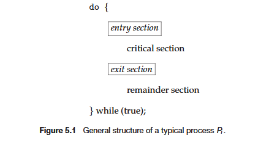

It have:
- `Entry section` ~ request permission to enter its critical section.
- `Exit section` ~ Notify the process leave the critical section
- `Remainder section` ~ The remaining code. 

A solution to the critical-section problem must satisfy the following three requirements:
1. **Mutual exclusion.** If process `Pi` is executing in its critical section, then no other processes can be executing in their critical sections.
2. **Progress.** If no process is executing in its critical section and some processes wish to enter their critical sections, then only those processes that are not executing in their remainder sections can participate in deciding which will enter its critical section next, and this selection cannot be postponed indefinitely.
3. **Bounded waiting.** There exists a bound, or limit, on the number of times that other processes are allowed to enter their critical sections after a process has made a request to enter its critical section and before that request is granted.

Two general approaches are used to handle critical sections in operating systems: 
- `Preemptive kernels`: A preemptive kernel allows a process to be preempted while it is running in kernel mode.
- `Non-preemptive kernels`: A non preemptive kernel does not allow a process running in kernel mode to be preempted; a kernel-mode process will run until it exits kernel mode, blocks, or voluntarily yields control of the CPU.
  - A non preemptive kernel is essentially free from race conditions on kernel data structures, as only one process is active in the kernel at a time.

## Peterson’s Solution

A classic software-based solution to the critical-section problem.
  - Peterson’s are not guaranteed to work on modern computer architectures.

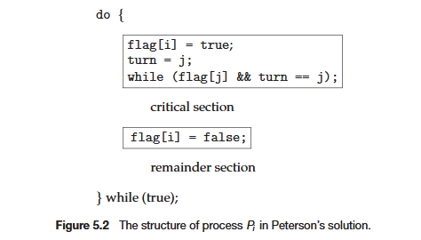

Peterson’s solution requires the two processes to share two data items:
- `int turn;` ~ The variable turn indicates whose turn it is to enter its critical section.
- `boolean flag[2];` ~ The `flag` array is used to indicate if a process is ready to enter its critical section.

[Code Example](./Code/Chapter_5/5.8/main.c)

With the code, the condition `while (flag[j] && turn == j);` make sure only one thread that execute critical section at the same time. `turn` only be `i` or `j`, can't be both.

## Synchronization Hardware

`Locking` that is, protecting critical regions through the use of locks

### Mutex Locks

A `mutex lock` has a boolean variable available whose value indicates if the lock is available or not.

One process or thread `release()` then the other process `acquire()`

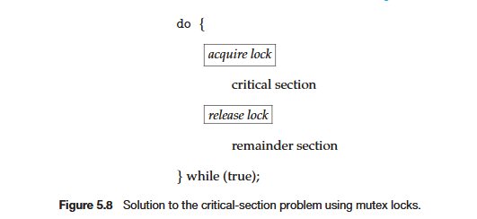

The main disadvantage of the implementation given here is that it requires `busy waiting` 
  - It mean While a process is in its critical section, any other process that tries to enter its critical section must loop continuously in the call to `acquire()` ~ `spinlock`

### Semaphores

A semaphore `S` is an integer variable that, apart from initialization, is accessed only through two standard atomic operations: `wait()` and `signal()`.

```c
wait(S) {
  while (S <= 0)
  ; // busy wait
  S--;
}
```

```c
signal(S) {
  S++;
}
```

#### Semaphore Usage

- `Counting semaphore` ~  range over an unrestricted domain.

- `Binary semaphore` ~ range only between 0 and 1 ~ similarly to mutex locks

Counting semaphores can be used to control access to a given resource consisting of a finite number of instances.
  - When a process releases a resource -> `signal()` ~ incrementing the count.
  - When the count for the semaphore goes to `0`, all resources are being used.
  - Other process will block until the count becomes greater than `0` again.

We can make process execute in order with the process that need to execute first call `signal()`, the second process call `wait()`

#### Semaphore Implementation

To avoid **busy waiting**, When a process executes the `wait()` operation and finds that the `semaphore` value is not positivethe process can block itself.
  - The `block` operation places a process into a waiting queue associated with the semaphore, and the state of the process is switched to the `waiting` state
  - The process is restarted by a `wakeup()` operation, which changes the process from the `waiting` state to the `ready` state.
```c
typedef struct {
  int value;
  struct process *list;
} semaphore;
```

```c
wait(semaphore *S) {
  S->value--;
  if (S->value < 0) {
    add this process to S->list;
    block();
  }
}
```

```c
signal(semaphore *S) {
  S->value++;
  if (S->value <= 0) {
    remove a process P from S->list;
    wakeup(P);
  }
}
```

The list of waiting processes can be easily implemented by a link field in each `process control block (PCB)`

It is critical that semaphore operations be executed atomically
  - Can't `wait()` and `signal()` operations on the same semaphore at the same time. 

#### Deadlocks and Starvation

`deadlocked` ~ two or more processes are waiting indefinitely for an event that can be caused only by one of the waiting processes

`starvation` or `indefinite blocking` ~ processes wait indefinitely within the semaphore. Indefinite blocking may occur if we remove processes from the list associated with a semaphore in LIFO (last-in, first-out) order.

#### Priority Inversion

`Priority Inversion` problem is indirectly, a process with a lower priority has affected how long process with higher priority have to wait for resource.

Typically these systems solve the problem by implementing a `priority-inheritance protocol`
  - All processes that are accessing resources
needed by a higher-priority process inherit the higher priority until they are finished with the resources in question.
  - When they are finished, their priorities
revert to their original values.

## Classic Problems of Synchronization

### The Bounded-Buffer Problem

Ref: https://en.wikipedia.org/wiki/Producer%E2%80%93consumer_problem

The Bounded-Buffer Problem is a classical synchronization problem that arises in systems where multiple processes share a fixed-size buffer, typically for producer-consumer scenarios. It is also known as the Producer-Consumer Problem.

- **Buffer Overflow:** A producer must not add data to the buffer if it is already full.
- **Buffer Underflow:** A consumer must not remove data from the buffer if it is empty.
- **Race Conditions:** Simultaneous access to the buffer by producers and consumers must be synchronized to avoid inconsistencies (e.g., overwriting or corrupting data).

### The Readers – Writers Problem

We require that the writers have exclusive access to the shared database while writing to the database.

- No reader be kept waiting unless a writer has already obtained
permission to use the shared object. In other words, no reader should wait for other readers to finish simply because a writer is waiting.
- Once a writer is ready, that writer perform its write as soon as possible. In other words, if a writer is waiting to access the object, no new readers may start reading.

### The Dining-Philosophers Problem

Ref: https://en.wikipedia.org/wiki/Dining_philosophers_problem

Monitors are a high-level synchronization construct.

The monitor construct ensures that only one process at a time is active within the monitor.

## Monitors

An abstract data type

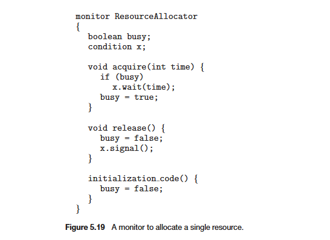

**Key Features of Monitors**

1. **Encapsulation**:
   - A monitor encapsulates shared variables, data structures, and methods to manipulate them.
   - Only the monitor's methods can access the shared variables, ensuring controlled access.

2. **Mutual Exclusion**:
   - At most, one thread can execute a monitor method at any time. This prevents race conditions.

3. **Condition Variables**:
   - Monitors use condition variables to allow threads to wait or signal each other about specific conditions.
   - Condition variables are associated with two operations:
     - **Wait**: A thread waits for a condition to be true.
     - **Signal**: A thread notifies one or more waiting threads that a condition is now true.

**How Monitors Work**
1. **Thread Entry**:
   - Only one thread can execute a monitor's method at a time. If another thread tries to enter while the monitor is occupied, it is blocked until the monitor becomes available.
   
2. **Condition Variables**:
   - Threads inside a monitor can release the monitor temporarily and wait for a condition using the `wait()` operation.
   - Other threads can signal the waiting threads when the condition becomes true, using the `signal()` operation.

3. **Synchronization**:
   - Monitors use an implicit lock (or mutex) to ensure mutual exclusion.
   - Condition variables allow threads to synchronize by waiting for and signaling changes in shared resource states.

## Synchronization Examples

**Windows:**

For kernel:
- On a single-processor system,  it temporarily masks interrupts for all interrupt handlers that may also access the global resource.
- On a multiprocessor system, Windows protects access to global resources
using spinlocks. The kernel ensures that a thread will never be preempted while holding a spinlock.

For hread synchronization outside the kernel
- Dispatcher objects.
- A critical-section object 


**Solaris:**
- An adaptive mutex
- turnstile

**P_thread:**
- `pthread_mutex_t`
- `#include <semaphore.h>` -> `sem_t sem;`


## Alternative Approaches

**Transactional Memory:**

Ref: https://stackoverflow.com/questions/11255640/what-is-transactional-memory

Transactional memory instead lets you designate sections of code as transactions. The transactional memory system (which can be implemented in hardware, software, or both) then attempts to give you the guarantee that any run of a program in which multiple threads execute transactions in parallel will be equivalent to a different run of the program in which the transactions all executed one after another, never at the same time.

**OpenMP:**

[OpenMP critical section protection](image.png)

Still identify possible race conditions and adequately protect shared data using the this.

**Functional Programming Languages:**
- The fundamental difference between imperative and functional languages is that functional languages do not maintain state. That is, once a variable has been defined and assigned a value, its value is `immutable`, it cannot change. Because functional languages disallow mutable state, they need not be concerned with issues such as race conditions and deadlocks

Ref - Erlang: https://www.erlang.org/doc/system/conc_prog.html

# Chapter 6

## Basic Concepts

### CPU– I/O Burst Cycle

The process execution consists of a cycle of CPU execution and I/O wait.

CPU burst <--> I/O burst.

- An I/O-bound program typically has many short CPU bursts. 
- A CPU-bound program might have a few long CPU bursts. 

This distribution can be important in the selection of an appropriate CPU-scheduling algorithm

### CPU Schedule

Short-term Scheduler

### Preemptive Scheduling

CPU-scheduling decisions may take place under the following four circumstances
1. When a process switches from the `running` state to the `waiting` state (for example, as the result of an I/O request or an invocation of wait() for the termination of a child process)
2. When a process switches from the `running` state to the `ready` state (for example, when an interrupt occurs)
3. When a process switches from the `waiting` state to the `ready` state (for example, at completion of I/O)
4. When a process terminates

`1` and `4` A new process (if one exists in the ready queue) always be selected for execution ~ `nonpreemptive`

However, in `2` and `3`, we can scheduling ~ `preemptive` ->  `race conditions`

### Dispatcher

A component in the CPU-scheduling function. It in charge:
- Switching context
- Switching to user mode
- Jumping to the proper location in the user program to restart that program

The time it takes for the dispatcher to stop one process and start another running is known as the `dispatch latency`

## Scheduling Criteria

To comparing CPU-scheduling algorithms. We have some important criteria:
- `CPU utilization`. We want to keep the CPU as busy as possible. Conceptually, CPU utilization can range from 0 to 100 percent. In a real system, it should range from 40 percent (for a lightly loaded system) to 90 percent (for a heavily loaded system).
- `Throughput`. If the CPU is busy executing processes, then work is being done. One measure of work is the number of processes that are completed per time unit, called throughput. For long processes, this rate may be one process per hour; for short transactions, it may be ten processes per second.
- `Turnaround time`. From the point of view of a particular process, the important criterion is how long it takes to execute that process. The interval from the time of submission of a process to the time of completion is the turnaround time. Turnaround time is the sum of the periods spent waiting to get into memory, waiting in the ready queue, executing on the CPU, and doing I/O.
- `Waiting time`. The CPU-scheduling algorithm does not affect the amount of time during which a process executes or does I/O. It affects only the amount of time that a process spends waiting in the ready queue. Waiting time is the sum of the periods spent waiting in the ready queue.
- `Response time`. In an interactive system, turnaround time may not be the best criterion. Often, a process can produce some output fairly early and can continue computing new results while previous results are being output to the user. Thus, another measure is the time from the submission of a request until the first response is produced. This measure, called response time, is the time it takes to start responding, not the time it takes to output the response. The turnaround time is generally limited by the speed of the output device

## Scheduling Algorithms

**First-Come, First-Served Scheduling**

- The average waiting time under the `FCFS` policy is often quite long.
- One more problem for `FCFS` is we have CPU-bound process and I/O-bound processes:
  - CPU-bound process will get and hold the CPU.
  - I/O-bound process will have to wait for CPU and the I/O devices are idle.

**Shortest-Job-First Scheduling**

When the CPU is available, it is assigned to the process that has the smallest next CPU burst. If the next CPU bursts of two processes are the same, `FCFS` scheduling is used to break the tie.

**Priority Scheduling**

The CPU is allocated to the process with the highest priority. Equal-priority processes are scheduled in `FCFS` order.

A major problem with priority scheduling algorithms is `indefinite blocking`, or `starvation`.

**Round-Robin Scheduling**

It is similar to FCFS scheduling, but preemption is added to enable the system to switch between processes

**Multilevel Queue Scheduling** 

A multilevel queue scheduling algorithm partitions the ready queue into several separate queues. Each queue has **absolute** priority over lower-priority queues.

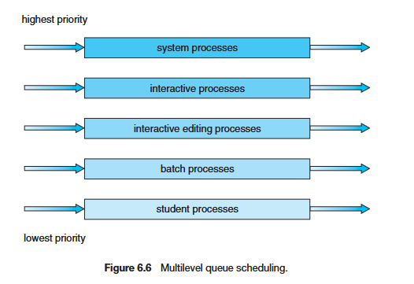

**Multilevel Feedback Queue Scheduling**

Like `Multilevel Queue Scheduling` but allows a process to move between queues.

In general, a multilevel feedback queue scheduler is defined by the
following parameters:
- The number of queues
- The scheduling algorithm for each queue
- The method used to determine when to upgrade a process to a higher-priority queue
- The method used to determine when to demote a process to a lower-priority queue
- The method used to determine which queue a process will enter when that process needs service

## Thread Scheduling

**Contention Scope**
- Process-contention scope (`PCS`)
  - The thread library schedules user-level threads to run on an available `LWP`.
  - `PCS` is done according to priority—the scheduler selects the runnable thread with the highest priority to run.
- System-contention scope (`SCS`)

**Pthread Scheduling**

The POSIX Pthread API allows specifying PCS or SCS during thread creation
- `PTHREAD_SCOPE_PROCESS` schedules threads using PCS scheduling.
- `PTHREAD_SCOPE_SYSTEM` schedules threads using SCS scheduling.

## Multiple-Processor Scheduling

**Approaches to Multiple-Processor Scheduling**

We can use a single processor ~ the master server to scheduling decisions, I/O processing, and other system activities
  - This `asymmetric multiprocessing` is simple because only one processor accesses the system data structures, reducing the need for data sharing.

A second approach uses `symmetric multiprocessing` (`SMP`) ~ where each
processor is self-scheduling

**Processor Affinity**

Because of the high cost of **invalidating** and **repopulating caches**, most `SMP` systems try to avoid migration of processes from one processor to another and instead attempt to keep a process running on the same processor. This is known as `processor affinity`

Processor affinity takes several forms:
- `soft affinity` ~ not guaranteeing to keep a process running on the same processor
- `hard affinity` ~ allowing a process to specify a subset of processors on which it may run.

**Load Balancing**

On `SMP` systems, it is important to keep the workload balanced among all processors to fully utilize the benefits of having more than one processor.

There are two general approaches to load balancing: 
- `push migration` ~ a specific task periodically checks the load on each processor and push processes from overloaded to idle or less-busy
processors
- `pull migration` ~ when an idle processor pulls a waiting task
from a busy processor

**Multicore Processors**

Multicore processor: multiple processor cores on the same physical chip.

`memory stall` when a processor accesses memory, it spends a significant amount of time waiting for the data to become available.

Many recent hardware designs have implemented multithreaded processor cores in which two (or more) hardware threads are assigned to each core
- That way, if one thread stalls while waiting for memory, the core can switch to another thread.

In general, there are two ways to multithread a processing core: 
- Coarse-grained: a thread executes on a processor until a long-latency event such as a `memory stall` occur.
- Fine-grained multithreading: switches between threads at a much finer level of granularity, typically at the boundary of an instruction cycle.

## Real-Time CPU Scheduling

CPU scheduling for real-time operating systems
- `Soft real-time systems`
  - No guarantee as to when a critical real-time process will be scheduled.
  - Guarantee only that the process will be given preference over noncritical processes.
- `Hard real-time systems` ~ stricter requirements
  - A task must be serviced by its deadline;
  - Service after the deadline has expired is the same as no service at all.

**Minimizing Latency**

Two types of latencies affect the performance of real-time systems:
1. Interrupt latency ~ the period of time that services the changing interrupt
2. Dispatch latency ~ The amount of time required for the scheduling dispatcher to stop one process and start another
   1. The most effective technique for keeping dispatch latency low is to provide preemptive kernels.

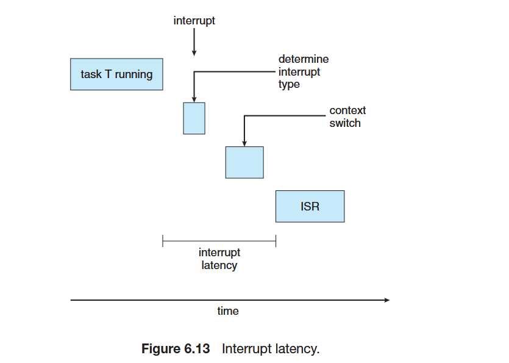
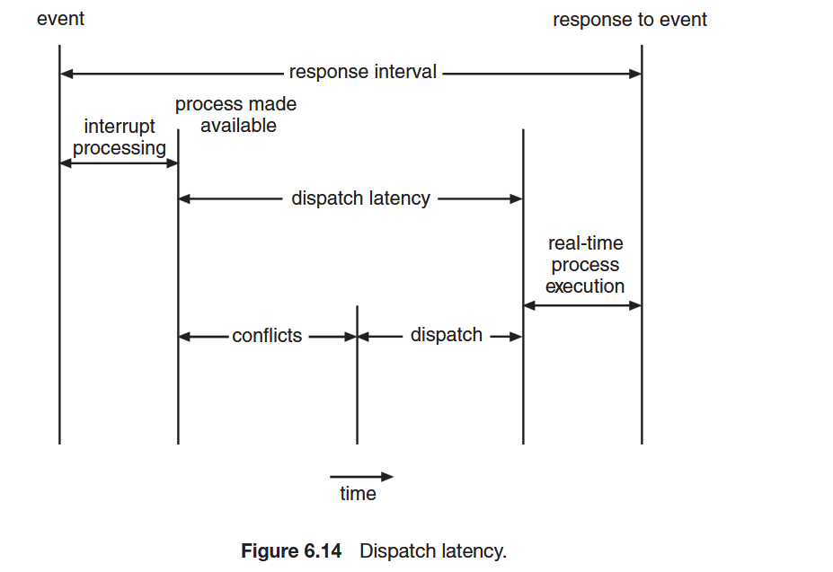

**Priority-Based Scheduling**

The scheduler for a real-time operating system must support a priority-based algorithm with preemption. Because it require CPU respond immediately when real-time process need CPU.

Some characteristics of the processes need to know:
- `periodic` ~ They require the CPU at constant intervals (periods).
- `rate` ~ The rate of a periodic task.

**Rate-Monotonic Scheduling**

A scheduling algorithm schedules periodic tasks using a static priority policy with preemption

**Earliest-Deadline-First Scheduling**
Scheduling dynamically assigns priorities according to deadline. 
- The earlier the deadline, the higher the priority.
- The later the deadline, the lower the priority.

**Proportional Share Scheduling**

**POSIX Real-Time Scheduling**

The POSIX standard provides extensions for real-time computing
- `SCHED FIFO`
- `SCHED RR`

[Example](./Code/Chapter_6/posixScheduleTest.c)

## Operating-System Examples

### Linux 

### Windows 

### Solaris

## Algorithm Evaluation

### Deterministic Modeling

### Queueing Models

### Simulation

### Implementation

# Chapter 7 Deadlocks